# Quantum Network Icons

We adopt the network icons as proposed in [the work by Van Meter et al](https://arxiv.org/abs/2112.07092) in our GUI simulator. We make the icons available in original SVG format and also in PNG with white or transparent background. The icons are free to use and we encourage everyone to adopt our icon set when drawing diagrams or topology in their literature. 

Currently, we provide 12 icons, each represent a node in a quantum network topology which should cover most of the different technologies and architectures. 
A brief description of each node is explained below.

## End Nodes

In our terminology, end nodes are the nodes which can have applications running on them. These nodes can generate connection setup requests and requests entangled resources such as Bell pair or general graph state. 
End node icons have square borders.

### Computation Node (COMP)

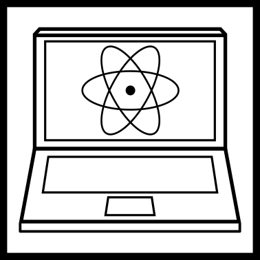

Computational end node capable of measuring quantum states as well as storing them in a quantum memory. 
This greatly enhances the nodes functionality and leads to advanced applications such as blind quantum computation. This node may vary in its processing abilities. Simple clients may be only able to generate, store and manipulate single-qubit states while advanced quantum servers may be able to create large multi-qubit entangled states and hence be capable of universal fault-tolerant quantum computation.

### Measurement Node (MEAS)

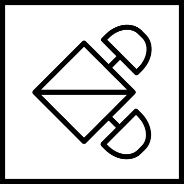

A node that can only measure received photons (in at least two different ways) and does not store qubits is actually surprisingly useful. A pair of such nodes can conduct quantum key distribution, or a single node of this type can serve as a terminal connecting to a full COMP node in order to execute one form of secure blind quantum computation~\cite{PhysRevA.87.050301}. However, its error management capabilities are very limited.

### Sensor Node (SNSR)

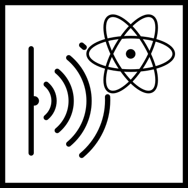

A sensor node uses the entangled states in a cyber-physical operation, e.g. as a reference frame for interferometry or clock synchronization. For these nodes in particular, recall that time is part of the service.

## Quantum Repeater Nodes

### 1G Repeater (REP1)

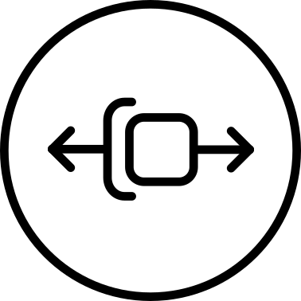

A 1G repeater.  Always has two interfaces. While recent experiments only allow one to be active a a time but the generalized form allows both to be active simultaneously. Its primary task is to perform entanglement swapping and error management in the form of purification on physical qubits.

### 2G Repeater (REP2)

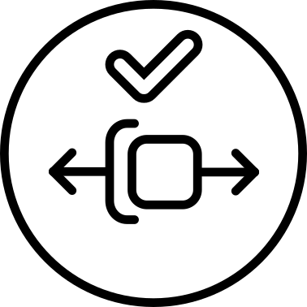

A 2G repeater. Has the same primary task of entanglement swapping as REP1 but operates at the level of encoded logical qubits composed of multiple physical qubits. Error management is achieved via error correction, signified by the check mark in the REP2 icon. REP2 must be equipped with hardware capable of handling a large number of physical qubits, which necessitates more advanced computational capabilities.

### Router (RTR)

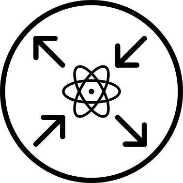

A router. A router likely consists of multiple line cards and a backplane, but for network architectural purposes, the important fact is that a router runs a full suite of protocols governing network operations.  Typically, a RTR will have three or more network interfaces, and is capable of governing a network border, where it may be called upon to speak both 1G and 2G protocols and to rewrite RuleSets, behaving as a Responder for connection requests (outbound or transit). 

**NOTE that in some literature, this is referred to as switches. We always refer to switch as just a photon rerouting device that does not have memories (see OSW below).**

## Support Nodes

### Entangled Photon Pair Source (EPPS)

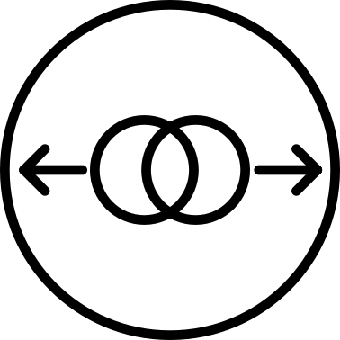

An entangled photon pair source, implemented using e.g. spontaneous parametric down conversion (SPDC). An EPPS simply produces pairs of entangled photons, which must be captured or measured at link end points. An EPPS can be used in terrestrial or on a satellite, with the photons captured by telescopes on the ground.

### Bell State Analyzer (BSA)

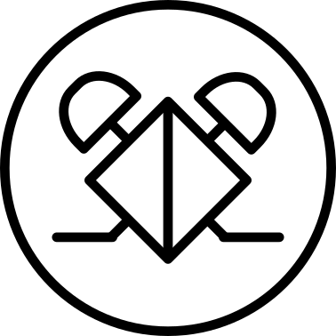

Bell State Analyzer, which projects two photons into one of the Bell states; usually used to swap memory-photon and photon-memory entanglement to memory-memory entanglement. The theoretical efficiency limit with linear optics implementation is 50%. The hardware complexity of the BSA depends on the particular qubit encoding.

### Repeater Graph State Source (RGSS)

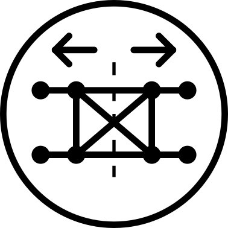

Repeater Graph State Source generates entangled multipartite photonic states used in memoryless repeater networks. It sends one half of the generated repeater graph state to its neighboring nodes where the photons are measured.

### Advanced Bell State Analyzer (ABSA)

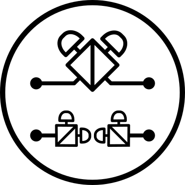

Advanced Bell State Analyzer. The basic BSA always performs the same operation, but all-optical repeaters based on repeater graph states require two-photon and single-photon measurements. The measurement basis (type of measurement) is selected dynamically based on prior measurement outcomes as well as the logical encoding and structure of the underlying repeater graph state. 
This makes the hardware, software and protocol implementations much more complex than a BSA.

### Optical Switch (OSW)

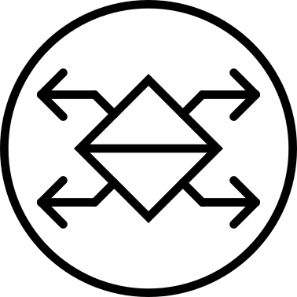

Optical switches (nanomechanical or otherwise) can be incorporated into the above node types, but they can also stand alone in the network, switching photons from link to link without measuring them.
