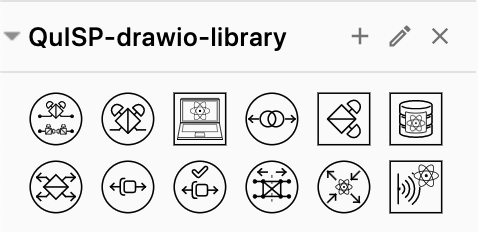

# QuISP icons as a diagrams.net library

[diagrams.net](https://app.diagrams.net/) (formerly draw.io) is a free online diagram software.

The file `quisp.xml` contains all the SVG icons in this repository bundled as a library that can be opened with diagrams.net (File -> Open Library...).

After opening the library, it appears as a set of _shapes_ than can be used in diagrams like the default ones shipped with the application.

We recommend that after importing the library to your diagrams.net working space, set the "perimeter" default style of each round icon to be "ellipse".
That will make the connecting lines touch the icon border instead of touching an invisible square border.
This needs to be set each time you import to your `quisp.xml` to your workspace but it should be saved if you are using local or signed-in version.

