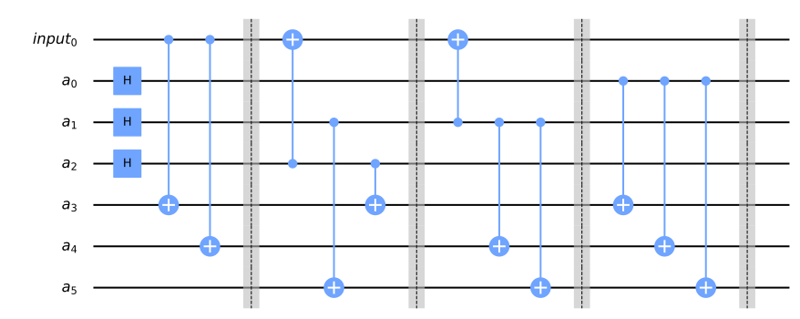
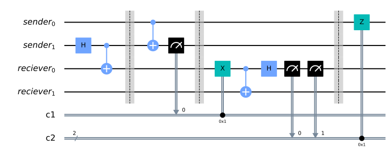
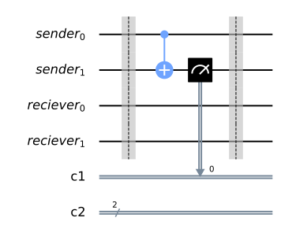
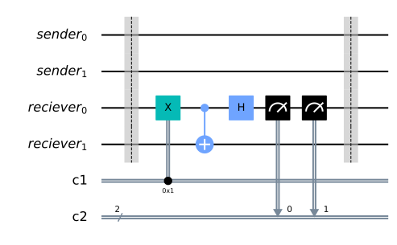
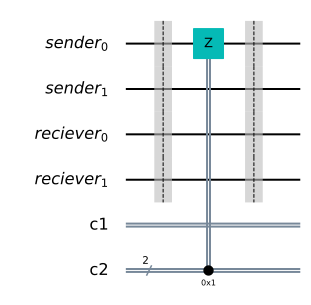
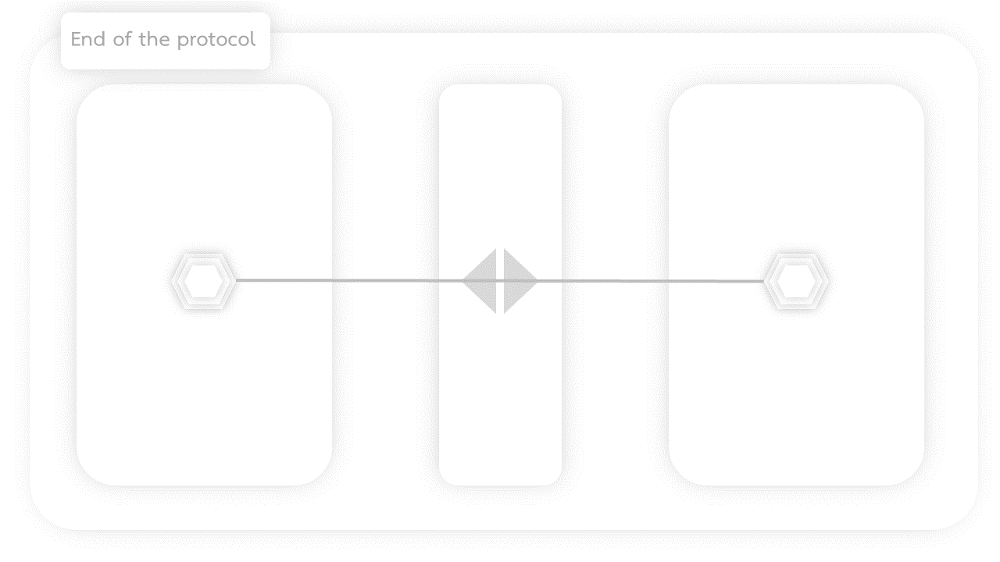

## 2nd Generation Quantum Repeater with \[7, 1, 3\] Steane Code

Summary of the procedure
<ol>
    <li>Send establish logical Bell pair request.</li>
    <li>Each node create their own logical qubit using Steane code and Generate ligth-matter Bell-pairs</li>
    <li>Send photonic qubits, one of the Bell pairs to BSA to establish 7 matter-matter Bell-pairs</li>
    <li>Perform non-local CNOT gate</li>
</ol>

### Steane code circuit


```python
from qiskit import QuantumCircuit, QuantumRegister, ClassicalRegister
qr_a = QuantumRegister(6, name='a');qr_input = QuantumRegister(1, name='input');qc = QuantumCircuit(qr_input, qr_a);qc.h([qr_a[0], qr_a[1], qr_a[2]])
qc.cx(qr_input[0], qr_a[3]); qc.cx(qr_input[0], qr_a[4]);qc.barrier();qc.cx(qr_a[2], qr_input[0]);qc.cx(qr_a[2], qr_a[3]);qc.cx(qr_a[1], qr_a[5]);qc.barrier();qc.cx(qr_a[1], qr_input[0]);qc.cx(qr_a[1], qr_a[4]);qc.cx(qr_a[1], qr_a[5]);qc.barrier();qc.cx(qr_a[0], qr_a[3]);qc.cx(qr_a[0], qr_a[4]);qc.cx(qr_a[0], qr_a[5]);qc.barrier()
qc.draw(output='mpl')
```





### Non-local CNOT gate


```python
qr_sender = QuantumRegister(2, name='sender');qr_reciever = QuantumRegister(2, name='reciever');cr_feedforward_1 = ClassicalRegister(1, 'c1');cr_feedforward_2 = ClassicalRegister(2, 'c2');qc = QuantumCircuit(qr_sender, qr_reciever, cr_feedforward_1, cr_feedforward_2)
qc.h(qr_sender[1]);qc.cx(qr_sender[1], qr_reciever[0]);qc.barrier();qc.cx(qr_sender[0], qr_sender[1]);qc.measure(qr_sender[1], cr_feedforward_1);qc.barrier();qc.x(qr_reciever[0]).c_if(cr_feedforward_1, 1);qc.cx(qr_reciever[0], qr_reciever[1]);qc.h(qr_reciever[0]);qc.measure(qr_reciever[0], cr_feedforward_2);qc.barrier();qc.z(qr_sender[0]).c_if(cr_feedforward_2, 1)
qc.draw(output='mpl')
```





The setting of link-layer should look like this.


The hexagon is memory (matter) qubit.

I will begin from very basic so that I don't miss anything easily.

|           |           |                                                |            Object            |                                               |
|-----------|-----------|:-----------------------------------------------|:-----------------------------|:----------------------------------------------|
| Timestamp | Algorithm | Sender                                         | BSA                          | Reciever                                      |
| 1         | A0        | Send request                                   |                              |                                               |
| 2         | A0        |                                                | Recieve request              | Recieve request                               |
| 3         | A0        |                                                |                              | Accept request                                |
| 4         | A0        |                                                |                              | Send RuleSet                                  |
| 5         | A0        | Receive RuleSet                                | Receive RuleSet              |                                               |
| 6         | A1        | Generate light-matter Bell pairs               |                              | Generate light-matter Bell pairs              |
| 7         | A2        | Send Photonic qubits to BSA                    |                              | Send Photonic qubits to BSA                   |
| 8         | A3        |                                                | Bell measurement             |                                               |
| 9         |           | <td colspan=3>Repeat protocol until get 7 matter-matter Bell pair   </td>                                                     |
| 10        | A4        | Encode logical qubit in state $\|+\rangle$     |                              | Encode logical qubit in state $\|0\rangle$    |
| 11        | A5        | Prepare non-local CNOT                         |                              | Prepare non-local CNOT                        |
| 12        | A5        | Local CNOT on memory qubit and matter qubit    |                              |                                               |
| 11        | A5        | Measure on Z- basis and Send Classical message |                              |                                               |
| 12        | A6        |                                                |                              | Receive message, Perform non-local CNOT       |
| 14        | A6        |                                                |                              | Local CNOT on memory qubit and matter qubit   |
| 15        | A6        |                                                |                              | Measure on X-basis and Send classical message |
| 16        | A7        | Receive message and perform operation          |                              |                                               |

Generate light-matter Bell pairs  <br>


**Algorithm 1:** GenerateLightMatterBellpairAction(arrivalTimeList)  
**Genrate light-matter Bell pair**  
&nbsp;&nbsp;&nbsp;&nbsp; input: arrivalTimeList  
&nbsp;&nbsp;&nbsp;&nbsp; output: SuccessGenerated <- Boolean Value

<pre>
1:  <b>procedure</b> GenerateLightMatterBellpairAction(arrivalTimeList)     
2:    SuccessGenerated = False
3:    currentTime = time.get()
4:    <b>if</b> currentTime < ArrivalTimeList[this] <b>then</b> 
5:      GenerateLightMatterBell <- Execute the protocol to generate matter-matter Bell pair
6:      SuccessGenerated = True
7:    <b>end</b>
8:    <b>return</b> SuccessGenerated
9: <b>end procedure</b>
</pre>

Send Photonic qubits to BSA


**Algorithm 2:** SendPhotonicQubitAction(arrivalTimeList)  
**Check if the logical qubit is ready before the arrival of first photonic qubit or not**  
&nbsp;&nbsp;&nbsp;&nbsp; input: arrivalTimeList  
&nbsp;&nbsp;&nbsp;&nbsp; output: SuccessSending <- Boolean Value

<pre>
<b>Require:</b> SuccessGenerated == True
1:  <b>procedure</b> SendPhotonicQubitAction(arrivalTimeList)  
2:    SuccessSending = False
3:    currentTime = time.get()
4:    <b>if</b> currentTime < arrivalTimeList[this] <b>then</b> 
5:      SendPhotonicQubit <- Send protonic qubit to BSA
6:      SuccessSending = True
6:    <b>end if</b>
7:    <b>return</b> SuccessSending
10: <b>end procedure</b>
</pre>

Bell measurement on photonic qubits


**Algorithm 3:** BellMeasurement(arrivalTimeList)  
**Measure photonic qubits using Bell basis**  
&nbsp;&nbsp;&nbsp;&nbsp; input: arrivalTimeList  
&nbsp;&nbsp;&nbsp;&nbsp; output: msg <- message containing measurement result

<pre>
1:  <b>procedure</b> BellMeasurement(arrivalTimeList)
2:    currentTime = time.get()
3:    <b>if</b> currentTime < arrivalTimeList[this] <b>then</b> 
4:      msg = BellMeasurement <- measure incoming qubits and get result
5:    <b>else</b>
6:      msg = "Fail"
7:    <b>end</b>
8:    <b>return</b> msg
9: <b>end procedure</b>
</pre>

**Algorithm 3.5:** CorrectionOperaionConditionalClause(msg)  
**Check the message from BSA if there is any operator**  
&nbsp;&nbsp;&nbsp;&nbsp; input: msg
&nbsp;&nbsp;&nbsp;&nbsp; output: CorrectionNeeded <- Boolean value

<pre>
1:  <b>procedure</b> CorrectionOperaionConditionalClause(msg)  
2:    CorrectionNeeded = False
4:    <b>if</b> msg != "Fail" <b>then</b> 
5:      SendPhotonicQubit <- Send protonic qubit to BSA
6:      CorrectionNeeded = True
6:    <b>end if</b>
7:    <b>return</b> CorrectionNeeded
10: <b>end procedure</b>
</pre>

Encode logical qubit for the protocol


**Algorithm 4:** EncodingAction(state, protocol)  
**Encode the state using Steane code according to instruction**  
&nbsp;&nbsp;&nbsp;&nbsp; input: state, protocol  
&nbsp;&nbsp;&nbsp;&nbsp; output: SuccessEncoding <- Boolean Value

<pre>
1:  <b>procedure</b> EncodingAction(state, protocol)
2:    stateToEncode = state
3:    encodeProtocol = protocol
4:    SuccessEncoding = False
5:    encoding <- encode state using selected encode protocol 
6:    <b>if</b> encoding.success == True <b>then</b>
7:      SuccessEncoding = True
8:    <b>end if</b>
9:    <b>return</b> SuccessEncoding
10: <b>end procedure</b>
</pre>


```python
qr_sender = QuantumRegister(2, name='sender');qr_reciever = QuantumRegister(2, name='reciever');cr_feedforward_1 = ClassicalRegister(1, 'c1');cr_feedforward_2 = ClassicalRegister(2, 'c2');qc = QuantumCircuit(qr_sender, qr_reciever, cr_feedforward_1, cr_feedforward_2)
qc.barrier();qc.cx(qr_sender[0], qr_sender[1]);qc.measure(qr_sender[1], cr_feedforward_1);qc.barrier();qc.draw(output='mpl')
```





**Algorithm 5:** nonLocalSenderAction(arrivalTimeList)  
**perform non-local CNOT operation on sender side **  
&nbsp;&nbsp;&nbsp;&nbsp; input: arrivalTimeList  
&nbsp;&nbsp;&nbsp;&nbsp; output: outcomeSender, timeoutSender

<pre>
<b>Require:</b> SuccessPreparing == True
1:  <b>procedure</b> nonLocalSenderAction(arrivalTimeList)
2:    timeoutSender = True
3:    outcomeSender = Null
4:    currentTime = time.get()
5:    <b>if</b> arrivalTimeList[0] < currentTime < arrivalTimeList[end] <b>then</b>
6:      localCNOT <- perform local CNOT gate on memory qubit and photonic qubit
7:      outcomeSender = measurePhotonicZ <- measure photonic qubit on Z-basis
8:      timeoutSender = False
9:    <b>end if</b>
10:   <b>return</b> outcomeSender, timeoutSender
11: <b>end procedure</b>
</pre>


```python
qr_sender = QuantumRegister(2, name='sender');qr_reciever = QuantumRegister(2, name='reciever');cr_feedforward_1 = ClassicalRegister(1, 'c1');cr_feedforward_2 = ClassicalRegister(2, 'c2');qc = QuantumCircuit(qr_sender, qr_reciever, cr_feedforward_1, cr_feedforward_2)
qc.barrier();qc.x(qr_reciever[0]).c_if(cr_feedforward_1, 1);qc.cx(qr_reciever[0], qr_reciever[1]);qc.h(qr_reciever[0]);qc.measure(qr_reciever[0], cr_feedforward_2);qc.barrier()
qc.draw(output='mpl')
```





**Algorithm 6:** nonLocalRecieverAction(arrivalTimeList, outcomeSender, timeoutSender)  
**perform non-local CNOT operation on reciever side **  
&nbsp;&nbsp;&nbsp;&nbsp; input: arrivalTimeList, outcomeSender, timeoutSender  
&nbsp;&nbsp;&nbsp;&nbsp; output: outcomeReciever, timeoutReciever

<pre>
<b>Require:</b> SuccessPreparing == True
1:  <b>procedure</b> nonLocalRecieverAction(arrivalTimeList, outcomeSender, timeoutSender)  
2:    timeoutReciever = True
3:    outcomeReciever = Null
4:    currentTime = time.get()
5:    <b>if</b> arrivalTimeList[0] < currentTime < arrivalTimeList[end] <b>and</b> timeoutSender == False <b>then</b>
6:      feedforwardOperation(outcomeSender) <- perform operation depend on outcome of the Sender 
7:      localCNOT <- perform local CNOT gate on memory qubit and photonic qubit
8:      outcomeReciever = measurePhotonicX <- measure photonic qubit on X-basis
9:      timeoutReciever = False
10:   <b>end if</b>
11:   <b>return</b> outcomeReciever, timeoutReciever
12: <b>end procedure</b>
</pre>


```python
qr_sender = QuantumRegister(2, name='sender');qr_reciever = QuantumRegister(2, name='reciever');cr_feedforward_1 = ClassicalRegister(1, 'c1');cr_feedforward_2 = ClassicalRegister(2, 'c2');qc = QuantumCircuit(qr_sender, qr_reciever, cr_feedforward_1, cr_feedforward_2)
qc.barrier();qc.z(qr_sender[0]).c_if(cr_feedforward_2, 1);qc.barrier();
qc.draw(output='mpl')
```





**Algorithm 7:** nonLocalSenderFeedbackAction(outcomeSender, timeoutSender)  
**Perform operation depend on outcome of Reciever measurement**  
&nbsp;&nbsp;&nbsp;&nbsp; input: outcomeSender, timeoutSender  
&nbsp;&nbsp;&nbsp;&nbsp; output: SuccessProtocol

<pre>
1:  <b>procedure</b> nonLocalSenderFeedbackAction(outcomeSender, timeoutSender)   
2:    SuccessProtocol = False
3:    <b>if</b> timeoutReciever == False <b>then</b>
4:      feedforwardOperation(outcomeReciever) <- perform operation depend on outcome of the Reciever
5:      SuccessProtocol = True
6:    <b>end if</b>
7:    <b>return</b> SuccessProtocol
8:  <b>end procedure</b>
</pre>

The cool hexagon is logical qubit



```python

```
