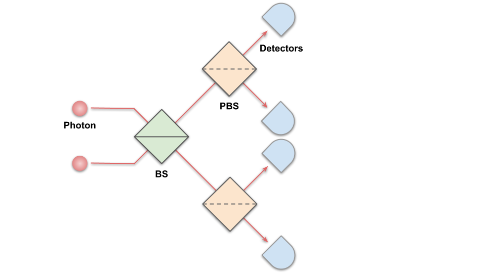
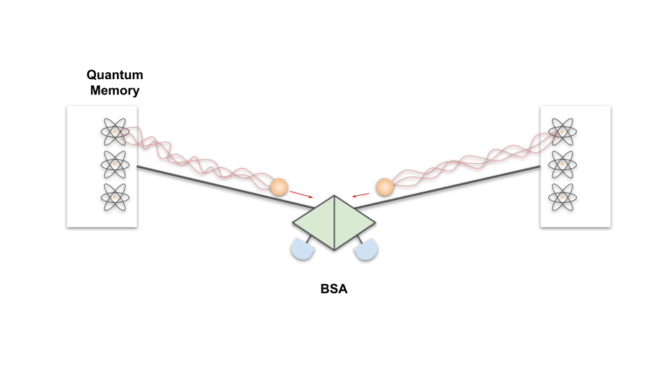
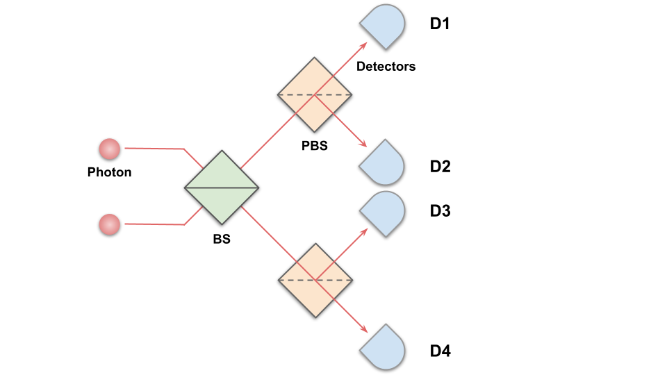
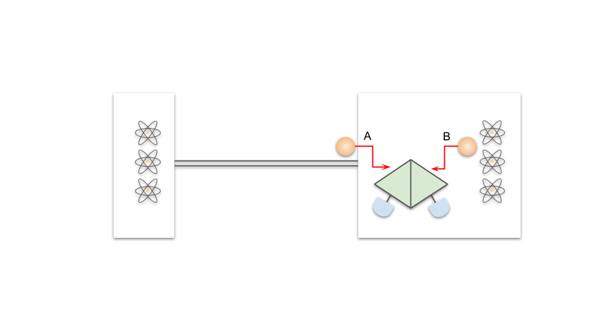
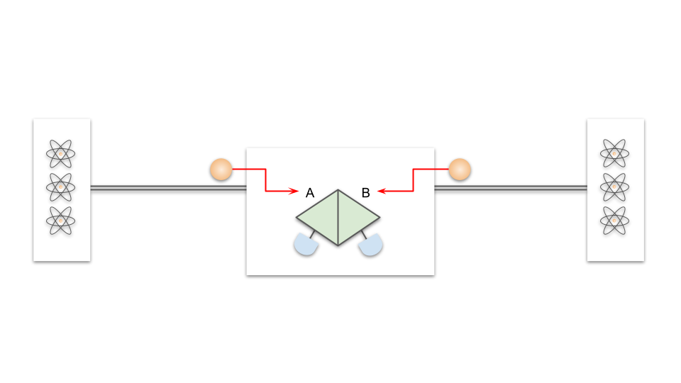

# Bell State Analyzer

# 1. What is this?

Bell State Analyzer (BSA) is crucial for generating entanglement, especially in photonic quantum systems. BSA performs a special type of measurement called "Bell state measurement" which plays an important role, especially in quantum communication. The most common way in the current implementation of BSA is to use linear optics with beam splitters (BS), polarizing beam splitters (PBS), and single-photon detectors.  

Schematic diagram of optical components in BSA

 BSA absorbs two incoming photons as input and performs Bell state measurement between these two photons, and it notifies if the Bell state measurement succeed or not based on the measurement result. 

In this document, we explain how the BSA with polarization qubits in linear optics works. 

# 2. Physics behind BSA

## 2.1 BSA step by step

As the inputs of BSA, we assume two photons entangled with matter qubit (quantum memory) or another photon as below.

Here, we assume those entangled states are  known as one of the Bell states, where  is horizontal polarization state and  is vertical polarization state. 

Beam splitter (or semi-reflective mirror) is one optical component that splits incident light into two, transmitted and reflected light. 

When there are joint detection in (D1, D3) or (D2, D4), the remaining qubit's state. If there are joint detection in (D1, D2) or (D3, D4), the state is .  In the case where both photons are detected at one detector, the state is  or .  It is impossible to distinguish either  or . From this fact,  the maximum success probability of linear optical Bell state measurement is known as theoretically limited to 50 %[4].

# What is the interface to the outside world?

BSA provides usually two interfaces through fiber or laser to take in two photons. 

# Who interacts with this interface?

There are two cases.

1. BSA is inside one of the nodes. (MM link)
2.  BSA is outside of the nodes. (MIM link)

## 1. MM link

When the BSA is placed inside one of the nodes in the link as below, one of the interfaces interacts with a photon coming from the other node (A). The other interface interacts with a photon from a matter qubit (B). 

## 2. MIM link

It is also possible to put BSA in the middle of two nodes. In this case, both (A) and (B) interact with photons from nodes.

## Remarks

## References

[1] [https://www.pas.rochester.edu/~howell/mysite2/Tutorials/Beamsplitter2.pdf](https://www.pas.rochester.edu/~howell/mysite2/Tutorials/Beamsplitter2.pdf)

[2] Osawa, Shuto, David S. Simon, and Alexander V. Sergienko. "Directionally-unbiased unitary optical devices in discrete-time quantum walks." Entropy 21.9 (2019): 853.

[3][https://copilot.caltech.edu/documents/16791/weihs_zeillinger_photon_statistics_at_beamsplitters_qip.pdf](https://copilot.caltech.edu/documents/16791/weihs_zeillinger_photon_statistics_at_beamsplitters_qip.pdf)

[4]Calsamiglia, John, and Norbert Lütkenhaus. "Maximum efficiency of a linear-optical Bell-state analyzer." Applied Physics B 72.1 (2001): 67-71.

[5] 武岡正裕. "古澤明, 量子光学の基礎; 量子の粒子性と波動性を統合する, 内田老鶴圃, 東京, 2013, vi+ 174p, 21× 15cm, 本体 3,500 円,[専門~ 学部向], ISBN978-4-7536-2030-2 (新著紹介)." 日本物理学会誌 69.10 (2014): 723-724.

[6] Lee, Seung-Woo, and Hyunseok Jeong. "Bell-state measurement and quantum teleportation using linear optics: two-photon pairs, entangled coherent states, and hybrid entanglement." arXiv preprint arXiv:1304.1214 (2013).

[7] Jennewein, Thomas, et al. "Experimental nonlocality proof of quantum teleportation and entanglement swapping." Physical review letters 88.1 (2001): 017903.

[8] [https://www.youtube.com/watch?v=tKMVjhiGOTw](https://www.youtube.com/watch?v=tKMVjhiGOTw)