# Installating Omnetpp GUI and Native Quisp on Windows OS

## TL;DR
* Before You Start
* OMNeT++ Installation
* Install Needed Tools for the GUI
* Cloning and Building Quisp 
* Running A Simulation


## Before You Start
Before you begin installing OMNeT++ and Quisp, make sure you have a C++ compiler on computer. If you do, skip to step 1, if you don't, head to [this](https://www.tutorialspoint.com/How-do-I-set-up-C-Cplusplus-on-Eclipse-in-Windows) link and get your compiler set up and then come back and go to step 1!


## 1- OMNeT++ Installation

OMNeT++ is an extensible, modular, component-based C++ simulation library and framework and is used to simulate the network. To download it, please click [here](https://omnetpp.org/download/).

OMNeT++ will be downloaded as a zip file. Once the download is complete, extract the file, you should see these files in the extracted directory.


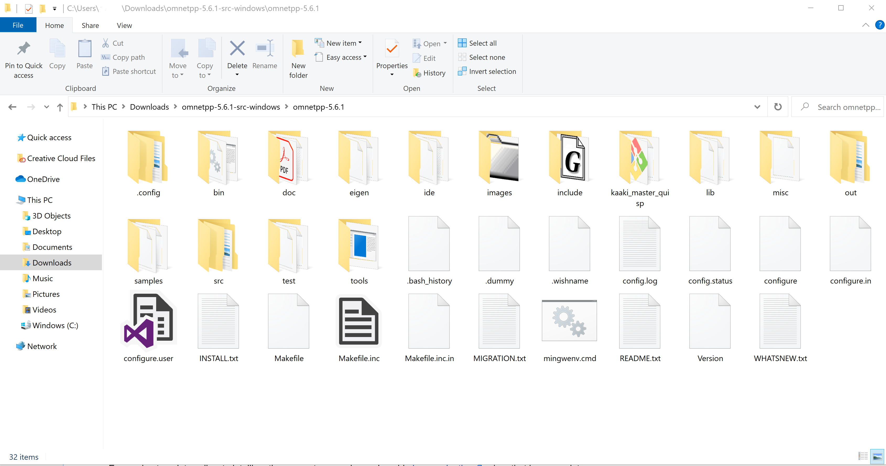


Run *mingwenv.cmd*, which will start a console with the MSYS bash shell.

In the shell type the following commands:

```
$ ./configure
$ make
```

This might take a while to finish executing. 

**To verify** that the installation has been successful, run the following:

```
$ cd samples/aloha
$ ./aloha
```

By default, the samples will run using the graphical Qtenv environment. You should see the following GUI windows.


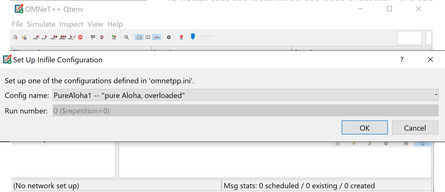

**Click OK**


Yay!! your installation was successful!!

**To run** the Omnetpp (OMNeT app), type the command
```
$ omnetpp
```

###### Whenever you want to run omnetpp, you will need to run from the mingwenv console.


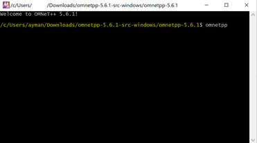

## 2- Install Needed Tools for the GUI
To run the simulation GUI, you will need to install *Eigen*.

In the mingwenv console, type the following command:
```
git clone https://gitlab.com/libeigen/eigen.git
```
For more information on Eigen, please visit [this](http://eigen.tuxfamily.org/index.php?title=Main_Page) site.


## 3- Cloning and Building Quisp

To clone and build Quisp, one your terminal (use the mingwenv console to clone the repo) and type the follwoing commands:
```
$ git clone https://github.com/sfc-aqua/quisp.git
```

## 4- Set up OMNeT for the Simulation

*Execute* the command `omnetpp` from mingwenv console. When the dialogue comes up, select your workspace and click *Launch*.  
  
*Warning: Setting workspace as `<Directory where you extracted omnetpp>\omnetpp-5.x.x\quisp` is highly recommended.*


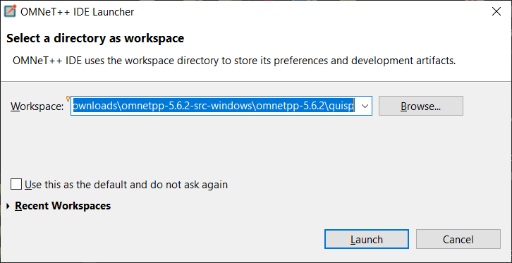


When you see this dialogue, just click *OK*.

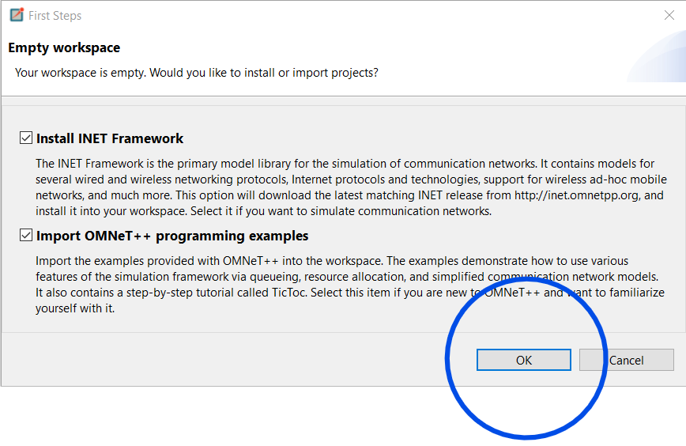


From File >> Open Projects from File System


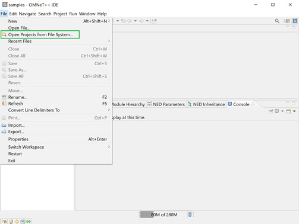

Click *Directroy* and find the location where Quisp was cloned (usually it will be in the omnet directroy). Select the `quisp` directory under the cloned `quisp`. So it should be `<Directory where you cloned quisp>\quisp\quisp`


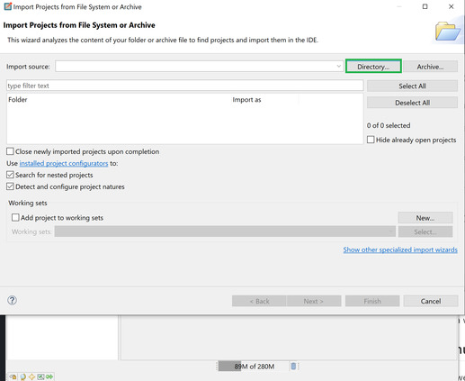

Select `quisp` and click *Finish*


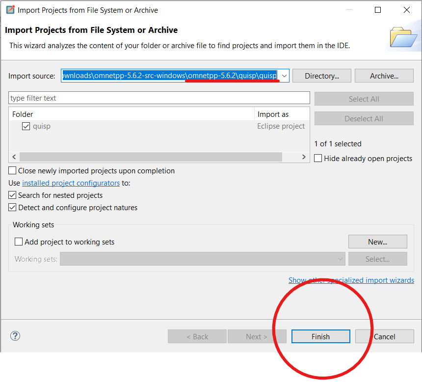

That will make *quisp* and *quisp* appear in your **Project Explorer** 

Select quisp, right-click on it and choose *properties*.


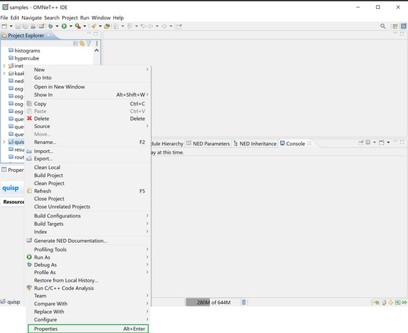

In the screen that shows up, expand OMNeT++, click on Makemake.
Select quisp from the middle and on the right-habd side, choose Makemake and then click on options. 


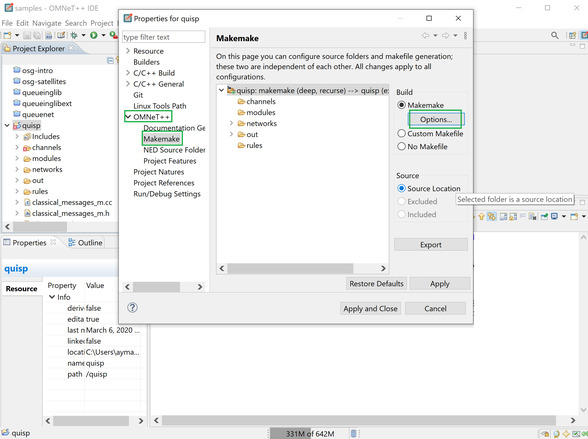

In the compile tab, click the add button 
and then choose the directroy for **Eigen** and click OK


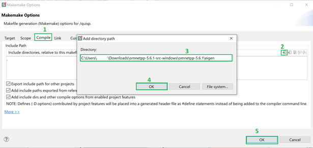

In the *Project Explorer* right-click on quisp and choose *Run As* > *OMNeT++ Simulation*.


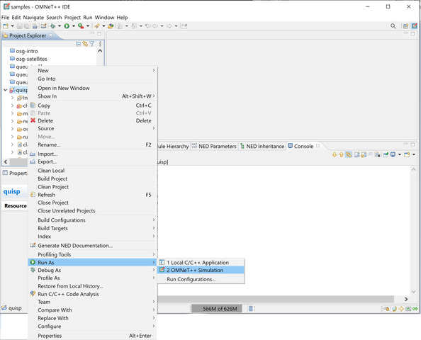


The following window will pop up, and it will take up to 2 mins to get the simulation set up.


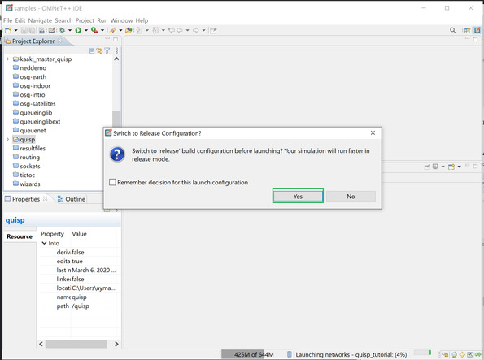


Test the simulation by choosing a *Config name*


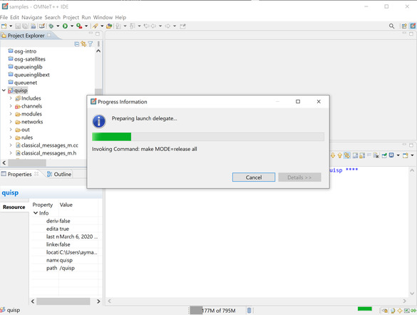


And Voilà !!! 


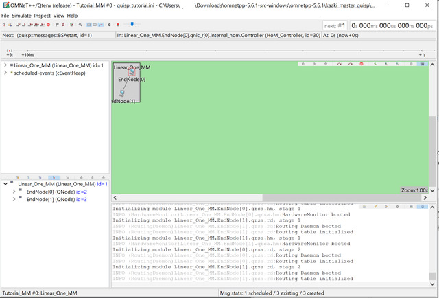


## 5- Running A Simulation

From File > Set Up an Unconfigured Network...


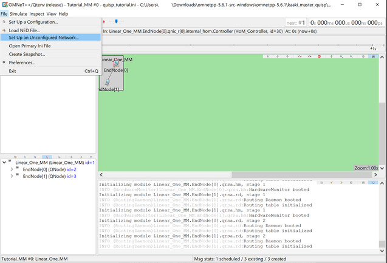


Choose a network and click OK.

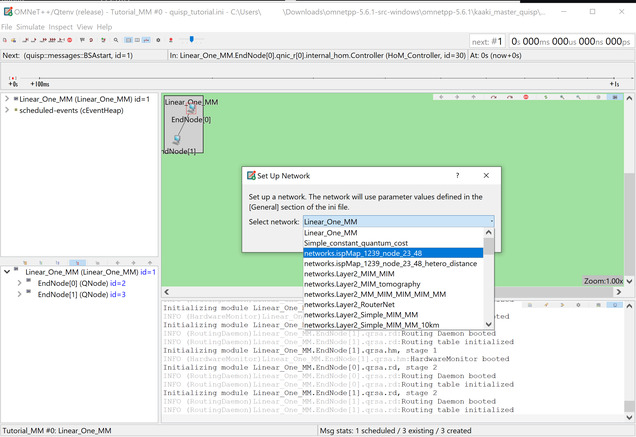


Enjoy the simulated results!!


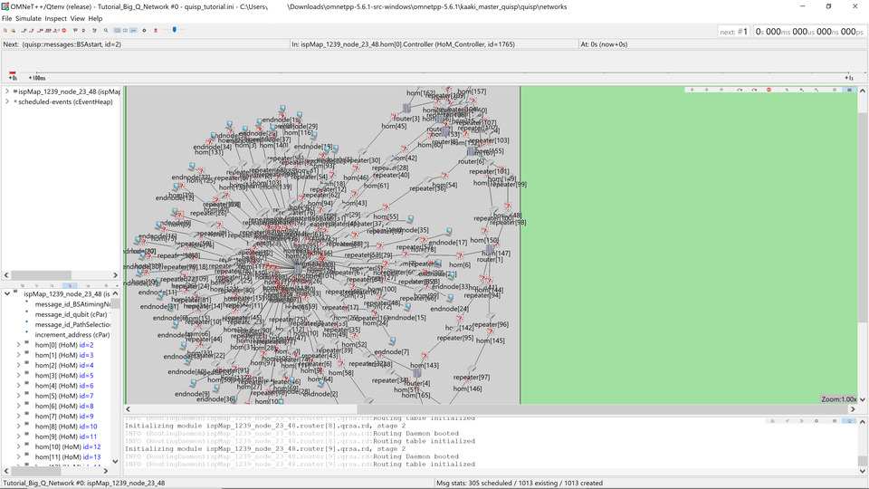


## Running interesting simulations

You should now be ready to simulate quantum networks!  Two places
you can go:

* Go to [running demos](running-demos.md).
* Just return to [the top-level readme](../README.md) and check
  options from there.
