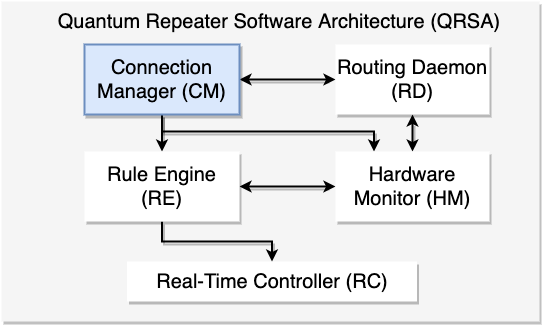

# Connection Manager

## What is this?

Connection Manager (CM) is one software component in Quantum Repeater Software Architecture (QRSA). Its job is to manage the connections between other nodes. 

Connection Managers in Repeaters and end nodes deal with three types of packets.

- Connection Setup Request
- Connection Setup Response
- Connection Setup Rejection

### Connection Setup Request

Connection Setup Request (CSReq) is initiated by the Initiator which starts some processes of quantum applications. This request contains requirements of final state (especially fidelity), and it is passed to the neighbor node based on routing table. CSReq travel through the path from the initiator to the responder and intermediate nodes provide their interface information (QNIC address, QNIC type, etc.) to the CSReq. 

When the CSReq reaches the responder, the responder starts to generate RuleSets based on the interface information and wrap them up as Connection Setup Response.

### Connection Setup Response

Connection Setup Response (CSRes) is prepared in the responder then distributed to the intermediate nodes. CSRes contains RuleSets that the node should refer during the process. 

### Connection Setup Rejection

When the link or node is somehow unable to use for the process (occupied by other link, connection unreachable, etc.), node has to reject the request from the initiator. Then, the request must be issued again to check if the link became available or not. 

## What is the interface to the outside world?

The interface of of connection manager is classical message which includes quantum interface information.

## How it is divided up into subsystems

## Who interact with this interface?

- Routing Daemon (RD)
    - RD provide interface information to CM
    - CM updates routing table
- Rule Engine (RE)
    - CM transfers RuleSets to RE
- Hardware Monitor (HM)
    - CM refers connection info to HM