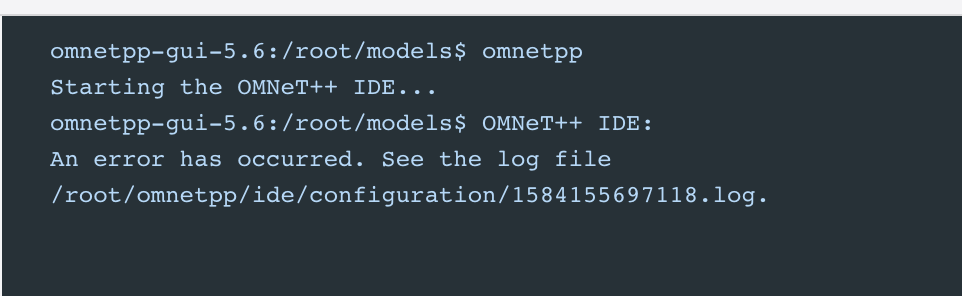
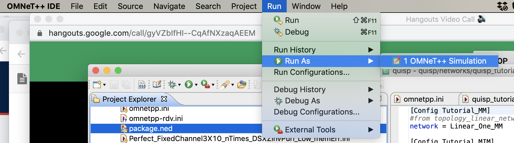

# Frequently Asked Questions (FAQ)

At this point, since all of our users are AQUA members, this is a set
of questions we frequently ask ourselves.

## Installation and getting it to run

* Q: I can't get it to install!!!
    - A: Welcome to the club.  Getting OMNeT++ to run is the biggest
  hassle.  Once you have that done, everything else is smooth.  There
  _are_ a lot of dependencies on other free software packages, as well
  as on Java.  The easiest install may be on a clean Ubuntu
  distribution, which can be done using Docker if you don't have such
  a machine handy.  See [doc/INSTALL.md](INSTALL.md) for
  additional info on troubleshooting.
* Q: I tried to build QuISP from inside OMNeT++, and it bombs with
  some error about cocoa?!?
    - A: Ah, yes, the famous lack of hot chocolate.  You need to run
    OMNeT++ from the command line, not the Finder (on a Mac), and you
    need to run `. setenv` to get some environment variables set
    properly.  n.b.: there are probably multiple `setenv` files
    floating around, and I'm not certain which you need.
* Q: I tried to start omnetpp, and I got this:

    - A: Same as above.  Do `. setenv` and try again, and it might work.
* Q: I get a Java error about a null pointer when I try to run
`quisp_tutorial.ini`or anything other than `omnetpp.ini`.
    - A: You might need to go to the Run menu and pick "Run As OMNeT++
    Simulation".

## Now what?

* Q: Wow, OMNeT++ runs!!! Exciting! ...now what?
    - A: See [the basic installation
    notes](INSTALL.md) if you haven't, which will show you how to add
    QuISP into OMNeT++, and run your first QuISP sims.  At the bottom
    of that you will find links to further build instructions, or you
    can skip straight to the [running demos](running-demos.md) if
    you've already gotten QuISP installed.
* Q: Okay, I got the basic first QuISP demo running.  What the heck
  are these .ini and .ned files, and how do I create my own?
    - A: Yup...  See, of course, [the OMNeT++
  documentation](https://doc.omnetpp.org/omnetpp/manual/).  There is a
  _very_ brief description at the [running demos](running-demos.md) doc.
* Q: There are a bunch of parameters in the .ini file that aren't
  described in the OMNeT++ documentation.  What are they?
    - A: Probably, you're looking at the quantum-specific parameters.
  At the moment, the best source of information on them is [Takaaki
  Matsuo's master's thesis](https://arxiv.org/abs/1908.10758).
* Q: QuISP is fantastic, but I want Feature X, which doesn't
  seem to be included...?
    - A: Time to start looking at the C++ code!  OMNeT++ is very
  sophisticated and rich, i.e. complicated, so you'll have a bit of
  learning to do, but hopefully our existing code serves as a good
  guide to what you'll need.  See also, of course, [the OMNeT++
  documentation](https://doc.omnetpp.org/omnetpp/manual/).
  There are a lot of [software design documents](software-design.md),
  which are potentially all suspect, as the code is evolving faster
  than the designs, and many elements of the desired design are still
  far from being implemented.  But all of this should help you help
  yourself, and help us!
* Q: Can I change the generation of RuleSets without changing C++
  code?
    - A: At the moment, no.
