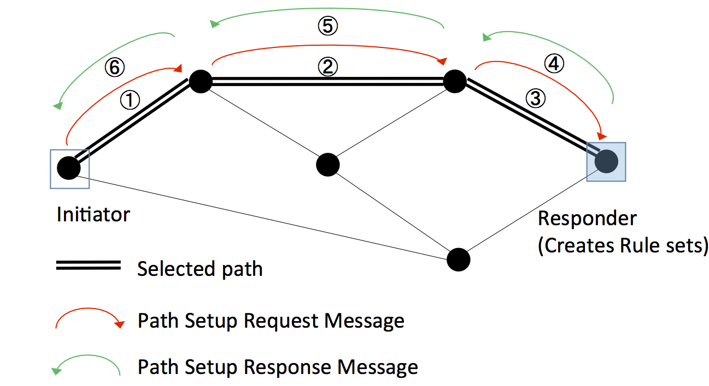

# Flat Path (Single Network) Setup Processing #

*Note: this file is an early design document, but should correspond well
to the existing implementation for single networks.  Internetworking
(recursive) connections and networks are not yet handled.  The Flat
Path setup should also correspond fairly closely to the [Internet Draft
by Van Meter &
Matsuo](https://tools.ietf.org/html/draft-van-meter-qirg-quantum-connection-setup-01)
(which, as of this writing, has expired, but will be revived).*

This page contains pseudocode for the processing at each repeater node during both the outbound and return phases of the connection setup. The contents of the messages themselves are specified separately.

See the top [Path Setup](Path Setup) page for links to the more complex recursive setup and to network-specific information.

# Basic Concept #

This is the simple form, with three basic phases:

1. The outbound request is routed from Initiator to Responder using standard NextHop-based forwarding table, accumulating information about the path along the way.
1. When the request arrives at the Responder, the Responder uses that information to create a complete [RuleSet](RuleSet) for every node.
1. The RuleSets are set back along the original path, with each node removing its RuleSet from the message, then forwarding on until it returns to the Initiator.

# Message Sequence for Routers #

1. ConnectionManager receives PathSetupRequest from end node or another repeater or router
2. ConnectionManager requests NextHop from RoutingDaemon based on destination address
3. ConnectionManager receives NextHop address and link info from RoutingDaemon
4. ConnectionManager rewrites PathSetupRequest
5. ConnectionManager sends PathSetupRequest to NextHop
   (next there is a long wait; no need for this router to store any state yet.)
6. ConnectionManager receives PathSetupReturn from NextHop, containing RuleSets
7. ConnectionManager extracts its RuleSet, conducts [resource allocation](Resource_Allocation.md) and any necessary security checks (esp. for DoS)
8. Install RuleSet into RuleEngine
9. Forward PathSetupReturn message to neighbor

Note that while this is going on, the RoutingDaemon is operating in the background, learning about the network topology and preparing Internet-style nexthop forwarding tables.  Because the NextHop information can change asynchronously between the PathSetupRequest and the PathSetupReturn, the router should depend on the contents of the message to determine where to send the Return message next, _not_ contact the RoutingDaemon again.

The RuleEngine is quiescent (with respect to this connection) until the RuleSet is actually installed.

# Pseudocode for processing a FlatPathSetupRequest message #

This is the "flat" version, with no recursion.
Depends on the [FlatPathSetupRequest (Outbound) Message Contents](FlatPathSetupRequest (Outbound) Message Contents).

    procedure ProcessFlatPathSetupRequest(Msg)
        Msg.HopStack.Push(MyHopInfo)
        if (MyAddr != Msg.ConnSpec.Responder)
            // Process and forward
            NextHop = GetNextHop(Msg.ConnSpec.Responder)
            LinkInfo = GetLinkInfo(NextHop)
            Msg.HopStack.Push(LinkInfo)
            Forward(NextHop,Msg)
        else
            // have reached the far end, need to build RuleSets
            // for everybody, then return
            ReturnMsg = ProcessFlatPath(Msg)
            MyRuleSet = ReturnMsg.RuleSetStack.Pop()
            InstallRuleSet(MyRuleSet)
            NextHop = ReturnMsg.RuleSetStack.Top.Addr
            Forward(NextHop,Msg)
        endif        
    endprocedure

Note that although we use the term "NextHop" here, that refers to a neighboring quantum node, and does not imply that the classical node's neighbor is necessarily the same; it could, in theory, pass through multiple nodes to get there.

# Pseudocode for processing a FlatPathSetupReturn message #

This is the "flat" version, with no recursion.  
Depends on the [FlatPathSetupReturn Message Contents](FlatPathSetupReturn Message Contents).

The RuleSetStack should only be empty if we are the "Initiator" node of the original request, so this should be followed by initiating the connection.

    procedure ProcessFlatPathSetupReturn(Msg)
        MyRuleSet = ReturnMsg.RuleSetStack.Pop()
        InstallRuleSet(MyRuleSet)
        If (ReturnMsg.RuleSetStack.Size != 0)
            NextHop = ReturnMsg.RuleSetStack.Top.Addr
            Forward(NextHop,Msg)
        endif
    endprocedure

