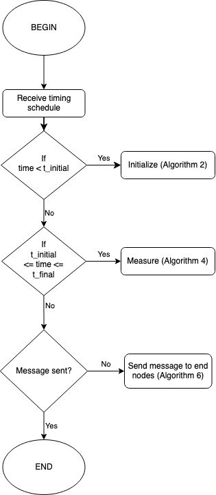

# RuleSets for all-optical quantum repeaters

Before we dive into individual RuleSets for various types of network nodes we go over the notation used in this document.

We begin with the __repeater graph state (RGS)__:

The RGS is given by  as shown in the Figure 1. It consists of two types of vertices. Orange vertices represent 1st leaf qubits which are encoded using a tree encoding with a branching vector denoted by .
The blue vertices represent physical qubits, usually called 2nd leaf qubits or arm qubits.
Total number of physical qubits for  is .
The example shown in Figure 1 with m=3 and  contains 60 physical qubits.

The __network link__ is shown in the following figure:

Each link consists of three types of nodes:
* __RGS node__ generates the photonic RGS using matter qubits and sends one half of the qubits to its neighbor to the right and the other half of the qubits to the left.
* __Mesurement node__ or __Advanced Bell State Analyzer (ABSA)__ receives one half of a RGS from boths its neighboring RGS nodes. The ABSA then measures the arm qubits in Bell basis. Depending on the outcome of the Bell mesurements the orange qubits are then measured in corresponding Pauli X or Pauli Z basis. The network link is composed of alternative RGS nodes and ABSA nodes.
* __End nodes__ of the link are the nodes trying to establish a shared entangled pair. [Comment: their precise functionality still needs to be discussed and determined. For now we assume they receive one half of a RGS from the neighboring RGS node.]

## 1. Repeater nodes

Time flow of the generation of the RGS:

1. Generate the encoded RGS. *[Comment: need to consider step-by-step generation using matter qubits and operation on them.]*
2. Send left half of the RGS to the left neighbor. Send right half to the right neoghbor.

## 2. ABSA nodes

__Assumptions:__
* We assume that the arrival of qubits at the ABSA is appropritely synchronized. *[Comment: Need to discuss how to synchronize the distribution of RGS across the link.]*

__Overview:__  
The RuleSet for ABSA nodes depends on the order of arrival of qubits from the source nodes. A pair of arm qubits arrive first from the left and right source nodes followed by their respective 1st-leaft neighbors as shown in Figure 3.

The explicit time schedule is also shown in Figure 3.
Each orange block represents  physical qubits corresponding to a single logical qubit.
The physical qubits constituting one logical qubit arrive in a way shown in Figure 3.

__Indirect Z measurement:__

Local Pauli measurements can be performed in a fault-tolerant manner on logical qubits encoded using a tree graph state as shown in Figure 1.
An indirect Z measurement can be used even after a failed direct Z measurement or after the qubit to be measured had been lost.

Figure 4 shows an indirect Z measurement. The parity of a failed Z measurement on qubit (i,j) can be inferred from a successful X measurement on any of the qubits on level i+1 that are leafs of qubit (i,j), and subsequent Z measurements (direct or indirect) on their leafs on level i+2. Figure 4 shows a successful inidirect measurement on qubit (i,j) despite two of the attempts having failed on subtree B and subtree C. Parity of the Z measurement on qubit (i,j) is given by the total parity of X and Z measurements on qubits of level i+1 and level i+2.

__Encoded measurements:__

The 1st-leaf qubits of an RGS ar eencoded in a tree structure and therefore have to be measured using encoded Pauli operators as shown in Figure 5.

Encoded Z measurement is performed by measuring all Level 1 qubits in Z basis, Level 2 qubits in X basis, Level 3 qubits in Z basis and so on.
The encoded measurement succeeds if all Level 1 qubits are measured successfully (either via direct or indirect Z measurements).

Encoded X measurement is performed by measuring all Level 1 qubits in X basis, Level 2 qubits in Z basis, Level 3 qubits in X basis and so on.
The encoded measurement succeeds if at least one of the Level 1 X measurements is successful and all its Level 2 leafs are successfully measured in Z (either via direct or indirect measurements).

__Flowchart:__ summarizing the role of the algorithms detailed below.

__Algorithm 1:__ initialTimeConditionalClause(arrivalTimeList)  
__This conditional clause checks whether current time is less than the scheduled arrival of first qubit.__  
&nbsp;&nbsp;&nbsp;&nbsp;&nbsp;&nbsp;Input: arrivalTimeList <- list of when qubits are scheduled to arrive at the ABSA node.  
&nbsp;&nbsp;&nbsp;&nbsp;&nbsp;&nbsp;Output: initalTime <- Boolean value.

<pre>
1:  <b>procedure</b> initialTimeConditionalClause(arrivalTimeList)
2:    initialTime = False
3:    currentTime = time.get()
4:    <b>if</b> currentTime < arrivalTimeList[0] <b>then</b>
5:      initialTime = True
6:    <b>end if</b>
7:    <b>return</b> initialTime
8:  <b>end procedure</b>
</pre>

__Algorithm 2:__ initializeAction()  
__This Action is used to set the measurement basis to Bell basis before the arrival of the first arm qubits, initialize the list of measurement outcomes, the Boolean value tracking whether a successful Bell measurement has occurred, and the Boolean variable tracking whether final message has been sent.__  
&nbsp;&nbsp;&nbsp;&nbsp;&nbsp;&nbsp;Input: none.  
&nbsp;&nbsp;&nbsp;&nbsp;&nbsp;&nbsp;Output: basis <- measurement basis, outcomeList <- list of measurement results, successBell <- Boolean value indicating whether successful Bell measurement has occured yet, msgSent <- Boolean value indicating whether final message has been sent yet.

<pre>
<b>Require:</b> initialTime == True
1:  <b>procedure</b> initializeAction()
2:    basis = Bell
3:    outcomeList = []
4:    successBell = False
5:    msgSent = False
6:    <b>return</b> basis, outcomeList, successBell, msgSent
7:  <b>end procedure</b>
</pre>

__Algorithm 3:__ timeConditionalClause(arrivalTimeList)  
__This conditional clause checks the current time and whether the ABSA node is required to measure any more qubits.__  
&nbsp;&nbsp;&nbsp;&nbsp;&nbsp;&nbsp;Input: arrivalTimeList.  
&nbsp;&nbsp;&nbsp;&nbsp;&nbsp;&nbsp;Output: measurementNeeded <- Boolean value.

<pre>
1:  <b>procedure</b> timeConditionalClause(arrivalTimeList)
2:    measurementNeeded = False
3:    currentTime = time.get()
4:    <b>if</b> arrivalTimeList[0] <= currentTime <= arrivalTimeList[end] <b>then</b>
5:      measurementNeeded = True
6:    <b>end if</b>
7:    <b>return</b> measurementNeeded
8:  <b>end procedure</b>
</pre>

__Algorithm 4:__ measurementAction(basis, outcomeList, successBell)  
__This Action  performs the correct measurements on the two arriving qubits, updates the outcomeList and basis for the next measurements.__  
&nbsp;&nbsp;&nbsp;&nbsp;&nbsp;&nbsp;Input: basis, outcomeList, successBell.  
&nbsp;&nbsp;&nbsp;&nbsp;&nbsp;&nbsp;Output: basis, outcomeList, successBell.

<pre>
<b>Require:</b> measurementNeeded == True
1:  <b>procedure</b> measurementAction(basis, outcomeList, successBell)
2:    resource1 = qubit from left source node
3:    resource2 = qubit from right source node
4:    outcome = measure(resource1, resource2, basis)
5:    outcomeList.append((basis, outcome))
6:    <b>if</b> basis != Bell <b>then</b>
7:      basis = Bell
8:    <b>else if</b> basis == Bell <b>then</b>
9:      <b>if</b> (outcome.success() == True and successBell == False) <b>then</b>
10:       basis = X
11:       successBell = True
12:     <b>else</b>
13:       basis = Z
14:     <b>end if</b>
15:   <b>end if</b>
16:   <b>return</b> basis, outcomeList, successBell
17: <b>end procedure</b>
</pre>

__Algorithm 5:__ finalTimeConditionalClause(arrivalTimeList)  
__This Conditional Clause checks whether current time is larger than the scheduled arrival tiem of the last qubits.__  
&nbsp;&nbsp;&nbsp;&nbsp;&nbsp;&nbsp;Input: arrivalTimeList.  
&nbsp;&nbsp;&nbsp;&nbsp;&nbsp;&nbsp;Output: finalTime <- Boolean value.

<pre>
1:  <b>procedure</b> finalTimeConditionalClause(arrivalTimeList)
2:    finalTime = False
3:    currentTime = time.get()
4:    <b>if</b> currentTime > arrivalTimeList[end] <b>then</b>
5:      finalTime = True
6:    <b>end if</b>
7:    <b>return</b> finalTime
8:  <b>end procedure</b>
</pre>

__Algorithm 6:__ msgAction(outcomeList)
__This Action creates the final message after all measurements have been performed and sends it to the end nodes.__  
&nbsp;&nbsp;&nbsp;&nbsp;&nbsp;&nbsp;Input: outcomeList <- contains information about measurement bases and outcomes.  
&nbsp;&nbsp;&nbsp;&nbsp;&nbsp;&nbsp;Output: msg <- message sent to the end nodes.  

<pre>
<b>Require:</b> finalTime == True, msgSent == False.
1:  <b>procedure</b> msgAction(outcomeList)
2:    self_addr <- address of the ABSA node
3:    endLeft_addr <- address of the left end node
4:    endRight_addr <- address of the right end node
5:    msg.destination = [endLeft_addr, endRight_addr]
6:    msg.source = self_addr
7:    msg.data = outcomeList
8:    msgSent = True
9:    <b>return</b> msg
10: <b>end procedure</b>
</pre>

## 3. End nodes

__Final state__

