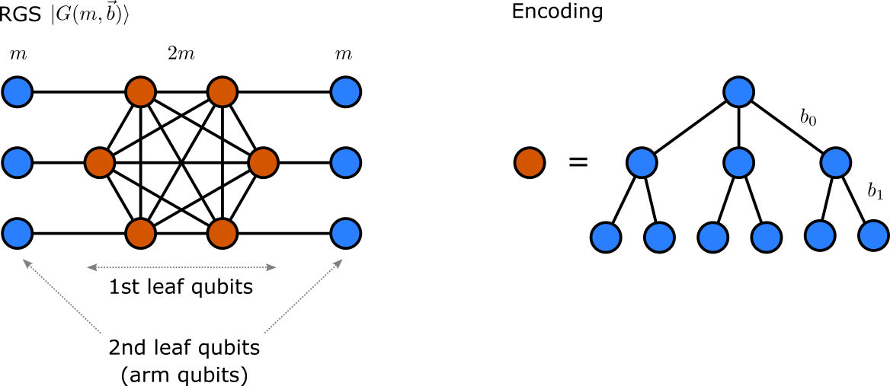
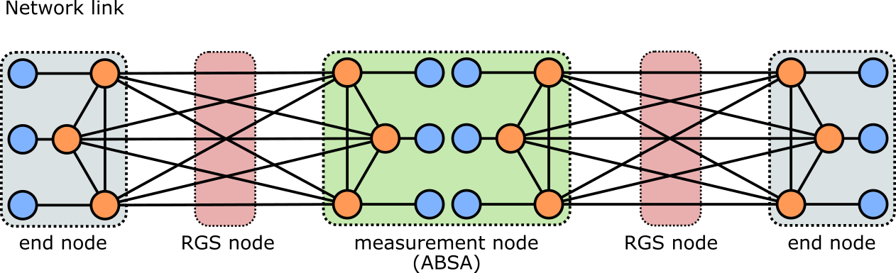

# RuleSets for all-optical quantum repeaters

Before we dive into individual RuleSets for various types of network nodes we go over the notation used in this document.

We begin with the __repeater graph state (RGS)__:

The RGS is given by  as shown in the figure. It consists of two types of vertices. Orange vertices represent 1st leaf qubits which are encoded using a tree encoding with a branching vector denoted by . In the figure, .
The blue vertices represent physical qubits, usually called 2nd leaf qubits or arm qubits. Each RGS has  1st leaf qubits and  arms qubits.

The __network link__ is shown in the following figure:

Each link consists of three types of nodes:
* __RGS nodes__ generate the RGS and send one half of the qubits to its neighbor to the right and the other half of the qubits to the left.
* __Mesurement node__ or __Advanced Bell State Analyzer (ABSA)__ receives one half of a RGS from boths its neighboring RGS nodes. The ABSA then measures the arm qubits in Bell basis. Depending on the outcome of the Bell mesurements the orange qubits are then measured in corresponding Pauli X or Pauli Z basis. The network link is composed of alternative RGS nodes and ABSA nodes.
* __End nodes__ of the link are the nodes trying to establish a shared entangled pair. [Comment: their precise functionality still needs to be discussed and determined. For now we assume they receive one half of a RGS from the neighboring RGS node.]

## 1. Repeater nodes

Time flow of the generation of the RGS:

1. Generate the encoded RGS. *[Comment: need to consider step-by-step generation using matter qubits and operation on them.]*
2. Send left half of the RGS to the left neighbor. Send right half to the right neoghbor.

## 2. ABSA nodes

__Assumptions:__
* We assume that the arrival of qubits at the ABSA is appropritely synchronized. *[Comment: Need to discuss how to synchronize the distribution of RGS across the link.]*

__Overview:__  
The RuleSet for ABSA nodes depends on the order of arrival of qubits from the source nodes. A pair of arm qubits arrive first from the left and right source nodes followed by their respective 1st-leaft neighbors as shown below.

Unlike with memory-based repeaters, there are no resources to manage and assign by the ABSA RuleSet Engine for the incoming arm qubits. They simply need to be measured in the appropriate bases.

__[Rewrite needed] Algorithm 1:__ BellAction(leftResourceList, rightResourceList)  
__This Action performs Bell measurements on incoming arm qubits. It then outputs the index of all successful measurements and passes it to the PauliResourceConditionClause.__  
&nbsp;&nbsp;&nbsp;&nbsp;&nbsp;&nbsp;Input: leftResourceList, rightResourceList  
&nbsp;&nbsp;&nbsp;&nbsp;&nbsp;&nbsp;Output: indexBellSuccess <- Index where successful Bell measurement occured.  

<pre>
1:	<b>procedure</b> BellAction(leftResourceList, rightResourceList)
2:		indexBellSuccess = []
3:		<b>for</b> each index in length(leftResourceList) <b>do</b>
4:			resourceLeft = leftResourceList[index]
5:			resourceRight = rightResourceList[index]
6:			outcome = measureBell(resourceLeft, resourceRight)
7:			<b>if</b> outcome.success() = True <b>then</b>
8:				indexBellSuccess.append(index)
9:			<b>end if</b>
10:		<b>end for</b>
11:		<b>return</b> indexBellSuccess
12:	<b>end procedure</b>
</pre>

__[Rewrite needed] Algorithm 2:__ BellConditionalClause(indexBellSuccess)  
__This Conditional Clasuse checks that at least one of the Bell measurements on arm qubits succeeded.__  
&nbsp;&nbsp;&nbsp;&nbsp;&nbsp;&nbsp;Input: indexBellSuccess <- list of indices of all successful Bell measurements  
&nbsp;&nbsp;&nbsp;&nbsp;&nbsp;&nbsp;Output: enoughResources <- Boolean value

<pre>
1:	<b>procedure</b> BellConditionalCLause(indexBellSuccess)
2:		enoughResources = False
3:		<b>if</b> length(indexBellSuccess) > 0 <b>then</b>
4:			enoughResources = True
5:		<b>end if</b>
6:		<b>return</b> enoughResources
7:	<b>end procedure</b>
</pre>

__[Rewrite needed] Algorithm 3:__ PauliAction(leftResourceList, rightResourceList, indexBellSuccess)  
__This Action performs local X measurement on 1st leaf qubits neoghboring a successful Bell measurement with the lowest index, and performs local Z measurements on all other 1st leaf qubits.__  
&nbsp;&nbsp;&nbsp;&nbsp;&nbsp;&nbsp;Input: leftResourceList, rightResourceList, indexBellSuccess  
&nbsp;&nbsp;&nbsp;&nbsp;&nbsp;&nbsp;Output: msg <- A message for the end nodes.

<pre>
<b>Require: </b> enoughResources == True
1:  <b>procedure</b> PauliAction(leftResourceList, rightResourceList, indexBellSuccess)
2:    leftOutcomeList = []
3:    rigthOutcomeList = []
4:    <b>for</b> each index in length(leftResourceList) <b>do</b>
5:      resourceLeft = leftResourceList[index]
6:      resourceRight = rightResourceList[index]
7:      <b>if</b> index == indexBellSuccess[0] <b>then</b>
8:        basis = X
9:      <b>end if</b>
10:      <b>else if</b>
11:        basis = Z
12:     <b>end if</b>
13:     outcomeLeft = measure(resourceLeft, basis)
14:     outcomeRight = measure(resourceRight, basis)
15:     leftOutcomeList.append((basis, outcomeLeft.value()))
16:     rightOutcomeList.append((basis, outcomeRight.value()))
17:   <b>end for</b>
18:   msg.generate()
19:   <b>return</b> msg
20: <b>end procedure</b>
</pre>

[Comment: Give details about the msg variable above. Also these are encoded local Pauli measurements. Need to implement measurements on physical qubits]

## 3. End nodes

__Final state__

