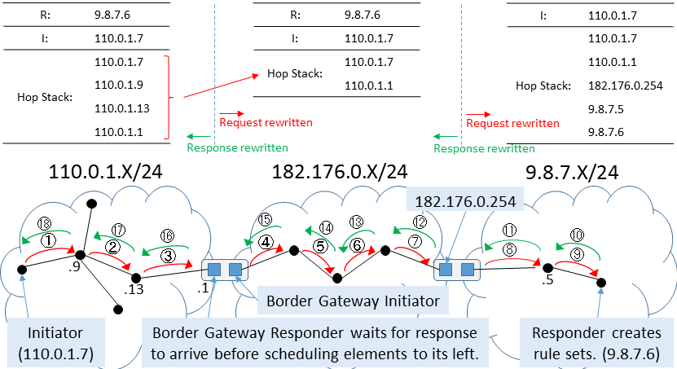

# Setting Up Paths Recursively: the Internetworking Case #

*Note: this file is an early design document (dating from 2016).
Internetworking (recursive) connections and networks are not yet
handled.  The Flat Path setup should correspond fairly closely to
the [Internet Draft by Van Meter &
Matsuo](https://tools.ietf.org/html/draft-van-meter-qirg-quantum-connection-setup-01)
(which, as of this writing, has expired, but will be revived).*

This is the purify-and-swap path setup algorithm for multiple hops,
and crossing network borders.  It breaks down the path and uses a
recursive algorithm in its setup, as we would expect in the full
Quantum Recursive Network Architecture (QRNA) (see
[References](References.md)).

Goals:

* Keep Initiators & Repeaters simple & stupid
* Allow incremental updates to Responders & Routers to improve network
* Path roles assignment intelligence is at the Responder
* Routing intelligence at the Router
    - Border Routers behave as both Initiator & Responder
* Interior topology of networks is to be hidden outside of that network
    - Apply recursion!

# A Few Design Notes #

(These should probably be merged with design notes elsewhere...)

* A node on the HopStack reports as its Fidelity the fidelity of an
  entanglement swapping operation, at the logical level.

# Example #

Three-network internetwork

* Initiator's network (three hops to Gateway)
* Transit network (four hops across)
* Responder's network (two hops to Responder)

The path that will be followed:

    110.0.1.7 Initiator (knows only single next-hop)
    110.0.1.9 Router (knows network internal topology and gateway to the rest of the Quantum Internet)
    110.0.1.13 Repeater (knows only left/right)
    110.0.1.1 Border Gateway Router (knows AS-level topology and next-hop in the transit network)
    182.176.0.5 Repeater (knows only left/right)
    182.176.0.6 Repeater (knows only left/right)
    182.176.0.7 Repeater (knows only left/right)
    182.176.0.254 Border Gateway Router (knows AS-level topology and next-hop in the transit network)
    9.8.7.5 Repeater (knows only left/right)
    9.8.7.6 Responder (intelligent, but knows only single next-hop and information about the path collected during the SetupRequest)

## Outbound Request ##

### Initiator's Network ###

Here is the initial request, as sent out:

    RecursivePathSetupRequest:
    (selected NextHop: 110.0.1.9; this is the only thing it knows
    about the topology!)

    Initiator: 110.0.1.7
    Responder: 9.8.7.6
    EndtoEndFidelity: 0.98
    HopStack:
        110.0.1.7: Fidelity 1.0, Latency 0 nsec
        (hop) Fidelity 0.99, Rate 6 Bell pairs/sec, Latency 1e5 nsec

110.0.1.9 adds its info to the HopStack and forwards.  As sent out
from 110.0.1.9:

    RecursivePathSetupRequest:
    (selected NextHop: 110.0.1.13)

    Initiator: 110.0.1.7
    Responder: 9.8.7.6
    EndtoEndFidelity: 0.98
    HopStack:
        110.0.1.7: Fidelity 1.0, Latency 0 nsec
        (hop) Fidelity 0.99, Rate 6 Bell pairs/sec, Latency 1e5 nsec
        110.0.1.9: Fidelity 0.999, Latency 10 nsec
        (hop) Fidelity 0.98, Rate 5.7 Bell pairs/sec, Latency 2e5 nsec

As sent out from 110.0.1.13:

    RecursivePathSetupRequest:
    (selected NextHop: 110.0.1.1)

    Initiator: 110.0.1.7
    Responder: 9.8.7.6
    EndtoEndFidelity: 0.98
    HopStack:
        110.0.1.7: Fidelity 1.0, Latency 0 nsec
        (hop) Fidelity 0.99, Rate 6 Bell pairs/sec, Latency 1e5 nsec
        110.0.1.9: Fidelity 0.999, Latency 10 nsec
        (hop) Fidelity 0.98, Rate 5.7 Bell pairs/sec, Latency 2e5 nsec
        110.0.1.13: Fidelity 0.999, Latency 10 nsec
        (hop) Fidelity 0.98, Rate 5.7 Bell pairs/sec, Latency 2e5 nsec

---

### Border Processing ###

110.0.1.1 is our Border Gateway, and collapses the HopStack to a
single hop, both to keep the information level manageable and to hide
the internals of its own network. It will ultimately act as a
Responder toward the original Initiator, and as an Initiator toward
the transit network. 

The gateway sets the Intermediate Initiator (II) flag in its own node
record in the HopStack, so that the gateway at the far side of the
transit network knows how much to collapse.

---

### Transit Network ###

Note that the details of what gets included in messages between here
and the far transit network border might yet change.

As sent out from 110.0.1.1:

    RecursivePathSetupRequest:
    (selected NextHop: 182.176.0.5)

    Initiator: 110.0.1.7
    Responder: 9.8.7.6
    EndtoEndFidelity: 0.98
    HopStack:
        110.0.1.7: Fidelity 1.0, Latency 0 nsec
        (hop) Fidelity 0.98, Rate 5.7 Bell pairs/sec, Latency 50020 nsec
        110.0.1.1: Fidelity 0.999, Latency 10 nsec Flags: II
        (hop) Fidelity 0.98, Rate 5.7 Bell pairs/sec, Latency 2e5 nsec

As sent out from 182.176.0.5:

    RecursivePathSetupRequest:
    (selected NextHop: 182.176.0.6)

    Initiator: 110.0.1.7
    Responder: 9.8.7.6
    EndtoEndFidelity: 0.98
    HopStack:
        110.0.1.7: Fidelity 1.0, Latency 0 nsec
        (hop) Fidelity 0.98, Rate 5.7 Bell pairs/sec, Latency 50020 nsec
        110.0.1.1: Fidelity 0.999, Latency 10 nsec Flags: II
        (hop) Fidelity 0.98, Rate 5.7 Bell pairs/sec, Latency 2e5 nsec
        182.176.0.5: Fidelity 0.999, Latency 10 nsec
        (hop) Fidelity 0.98, Rate 5.7 Bell pairs/sec, Latency 2e5 nsec

As sent out from 182.176.0.6:

    RecursivePathSetupRequest:
    (selected NextHop: 182.176.0.7)

    Initiator: 110.0.1.7
    Responder: 9.8.7.6
    EndtoEndFidelity: 0.98
    HopStack:
        110.0.1.7: Fidelity 1.0, Latency 0 nsec
        (hop) Fidelity 0.98, Rate 5.7 Bell pairs/sec, Latency 50020 nsec
        110.0.1.1: Fidelity 0.999, Latency 10 nsec Flags: II
        (hop) Fidelity 0.98, Rate 5.7 Bell pairs/sec, Latency 2e5 nsec
        182.176.0.5: Fidelity 0.999, Latency 10 nsec
        (hop) Fidelity 0.98, Rate 5.7 Bell pairs/sec, Latency 2e5 nsec
        182.176.0.6: Fidelity 0.999, Latency 10 nsec
        (hop) Fidelity 0.98, Rate 5.7 Bell pairs/sec, Latency 2e5 nsec

As sent out from 182.176.0.7:

    RecursivePathSetupRequest:
    (selected NextHop: 182.176.0.254)

    Initiator: 110.0.1.7
    Responder: 9.8.7.6
    EndtoEndFidelity: 0.98
    HopStack:
        110.0.1.7: Fidelity 1.0, Latency 0 nsec
        (hop) Fidelity 0.98, Rate 5.7 Bell pairs/sec, Latency 50020 nsec
        110.0.1.1: Fidelity 0.999, Latency 10 nsec Flags: II
        (hop) Fidelity 0.98, Rate 5.7 Bell pairs/sec, Latency 2e5 nsec
        182.176.0.5: Fidelity 0.999, Latency 10 nsec
        (hop) Fidelity 0.98, Rate 5.7 Bell pairs/sec, Latency 2e5 nsec
        182.176.0.6: Fidelity 0.999, Latency 10 nsec
        (hop) Fidelity 0.98, Rate 5.7 Bell pairs/sec, Latency 2e5 nsec
        182.176.0.7: Fidelity 0.999, Latency 10 nsec
        (hop) Fidelity 0.98, Rate 5.7 Bell pairs/sec, Latency 2e5 nsec

---

### Border Processing ###

182.176.0.254 is our next Border Gateway.  It collapses its own
network to a single hop.  Since this is a Fowler network, the fidelity
will be high.  It will ultimately act as a Responder toward the Border
Gateway on the other side of the transit network, and as an Initiator
toward the final Responder.

Since it has resolved the II flag set by 110.0.1.1 by collapsing the
HopStack, it clears that flag.  It sets one of its own on the outbound
request.  Note that having more than one II flag in the HopStack is
possible if true recursion is used, but in this example we are only
going one level deep.

---

### Responder's Network ###

As sent out from 182.176.0.254:

    RecursivePathSetupRequest:
    (selected NextHop: 9.8.7.5)

    Initiator: 110.0.1.7
    Responder: 9.8.7.6
    EndtoEndFidelity: 0.98
    HopStack:
        110.0.1.7: Fidelity 1.0, Latency 0 nsec
        (hop) Fidelity 0.98, Rate 5.7 Bell pairs/sec, Latency 50020 nsec
        110.0.1.1: Fidelity 0.999, Latency 10 nsec
        (hop) Fidelity 0.999, Rate 5.7 Bell pairs/sec, Latency 2e5 nsec
        182.176.0.254: Fidelity 0.999, Latency 10 nsec Flags: II
        (hop) Fidelity 0.98, Rate 5.7 Bell pairs/sec, Latency 2e5 nsec

As sent out from 9.8.7.5:

    RecursivePathSetupRequest:
    (selected NextHop: 9.8.7.6)

    Initiator: 110.0.1.7
    Responder: 9.8.7.6
    EndtoEndFidelity: 0.98
    HopStack:
        110.0.1.7: Fidelity 1.0, Latency 0 nsec
        (hop) Fidelity 0.98, Rate 5.7 Bell pairs/sec, Latency 50020 nsec
        110.0.1.1: Fidelity 0.999, Latency 10 nsec
        (hop) Fidelity 0.999, Rate 5.7 Bell pairs/sec, Latency 2e5 nsec
        182.176.0.254: Fidelity 0.999, Latency 10 nsec Flags: II
        (hop) Fidelity 0.98, Rate 5.7 Bell pairs/sec, Latency 2e5 nsec
        9.8.7.5: Fidelity 0.999, Latency 10 nsec
        (hop) Fidelity 0.98, Rate 5.7 Bell pairs/sec, Latency 2e5 nsec

## Request Processing at Responder ##

The Request, when it arrives at the actual final Responder, has a
HopStack of four hops: two in the local network, the transit network,
and the initiator's network.  (More generally, it will be the number
of ASes crossed plus the number of hops to the Border Gateway.)  The
apparent fidelity of the transit network is high.

The Responder can choose whether to ask for a bump in the fidelity at
each hop, or to add purification that crosses multiple hops (or
networks).  We know both are possible, but when intermediate hops and
memories have finite fidelity, adding end-to-end purification is the
only truly robust solution.

Let's assume here that the Responder adds multi-hop purification above
what the networks have promised.

## Return PathSetup Messages ##

### Responder's Network ###

### Transit Network ###

### Initiator's Network ###

# Pseudocode for Routers #

# Pseudocode for Responders #

The only viable option is for a Responder to treat the entire path as
a purify-and-swap path.  The processing function:

    procedure ProcessRecursivePathSetupRequest(Msg)
        LocalRuleSet = CollapseLocalNetwork(Msg.HopStack)

# Protocol #

# Open Issues #

1. We have decided, at least tentatively, that a border slices a router in two. May have to be revisited.
1. So, does a Repeater, Router or Border Gateway Router have one address or two? Do addresses map to a
node, or an interface?
1. There was a particular reason why I put the link and hop info
separately on the HopStack, but now I'm having trouble remembering
what it was...
1. As long as we have a global address space, it's pretty easy for a
Border Gateway to determine how far back in the HopStack it ought to
collapse/hide, but it's probably more robust to include a flag at the
Border Gateway that inserts the request into the network.  (Added.)
1. Is it acceptable for a Responder to ask for a higher-fidelity
operation than a node or network has offered?  Probably not.
Therefore, the _only_ thing it can do is to build further purification
on top of what is offered.
1. This leads to the question, should a Border Gateway offer its _best
possible_ fidelity, or a _working fidelity_ the same as the desired
E2E fidelity?  I think working fidelity for Dur-Briegel, and some high
fidelity for Fowler or Jiang.
1. What other information is needed in order to successfully create
connections?  Do we need to provide number of buffer memories
available? We have already decided that a complex system involving too
many parameters will be unwieldy and likely will not work well...
1. What network-level (as opposed to internetwork-level) information
is needed?  This should be consistent with the operation of an
individual network, as an Ethernet would be with IP.
1. We haven't addressed the issue of rejected requests yet at all.
1. Should the Responder collapse its own network first, before doing
the E2E processing?  I think so.  How, then, will the processing
differ if the Initiator and Responder are both in the same network?
