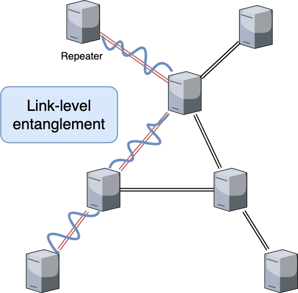
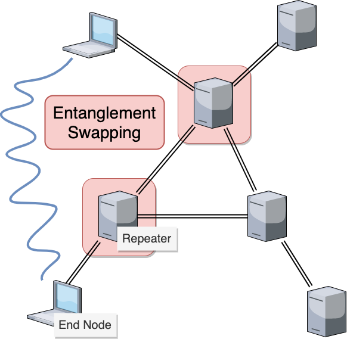
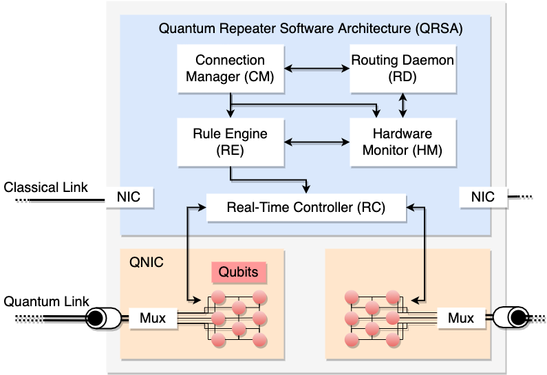

# Quantum Repeater

## What is this?

Quantum Repeater is one crucial network device in entanglement-based quantum networking, which allows us to extend link-level entanglement to end-to-end entanglement. 

The main works of quantum repeaters are following.

1. Creating base entanglement
2. Entanglement extension
3. Error management
4. Network operations

### 1. Creating base entanglement

Quantum Repeater generates entanglement between neighbor nodes known as link-level entanglement, relatively shorter distance entanglement. In practice, the distances between neighbor nodes should be decided by characteristics of the channel, such as attenuation, loss, error. 

Several link types have been proposed to generate this link-level entanglement, such as Memory-Memory architecture, Memory-Interfere-Memory architecture.  

### 2. Entanglement extension

The entanglement swapping is performed in each repeater station and extends link-level entanglement to end-to-end entanglement. Repeaters perform Bell state measurement to pair of qubits and extend link-level entanglement to multihop entanglement.

At the end of this process, the repeater must tell the result of Bell measurement to proper partners to correct state with Pauli operations. 

### 3. Error management

Quantum error is one critical obstacle for large-scale quantum networking. Keeping the fidelity of the quantum state is also one important task of a quantum repeater. For the near future (called 1G quantum networking), entanglement purification plays an important role to find errors in the quantum state and improving its quality.

### 4. Network operations

The repeater node behaves as an ordinal network node that is responsible for routing, multiplexing, etc. As mentioned above, repeaters must be capable of coordinating operations with other repeaters or end nodes.

## What is the interface to the outside world?

### Quantum Interface

QNIC (Quantum Network Interface Card) is the interface of quantum repeaters. QNIC contains quantum memories to store quantum information. 

### Classical Interface

Same as the classical network devices, the classical interface of the repeater is NIC.  

## How is it divided up into subsystems?

The quantum repeater is divided up into several subsystems. 

 

### Quantum Repeater Software Architecture (QRSA)

QRSA is composed of several software components that enable repeaters to work properly to establish end-to-end entanglement. See the following pages for more detailed explanations of each component. 

### QNIC
QNIC contains several to thousands qubits for holding entangled states between neighbor or remote quantum repeaters.

## References