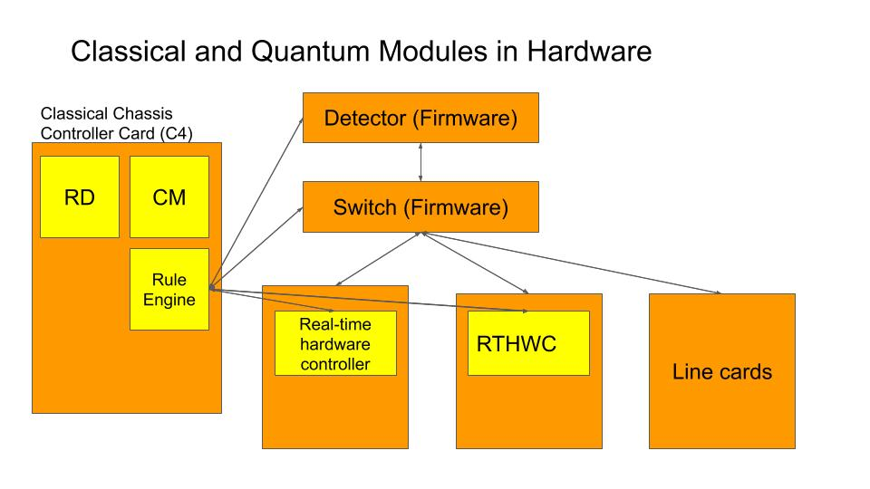
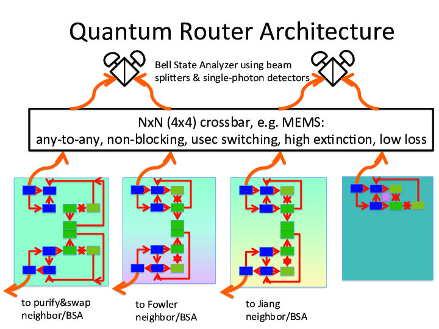
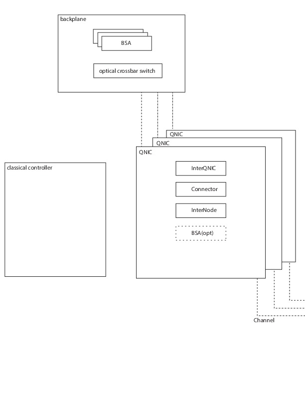

# Quantum Router Architecture #

*Note: This is an old design document, which we expect to still be useful, but it may or may not correspond well to the current implementation.*

Note that the above figure says "LC", but the correct term is "QNIC".

The quantum portion only of the hardware for a router is shown below.
(More detailed hardware block diagrams exist in [this ppt file](multicomputer-router-150429.ppt) and [this figure](router_blocks.pdf).)

An alternative view, including the C4 card, is shown below.

# Hardware Modules #

[C4](Classical%20Chassis%20Control%20Card%20(C4).md): Classical Chassis Controller Card: One per system.
<!--2. [Detector Array](Detector%20Array.md): One per system.  -->
<!--3. [Switch](Switch.md): One per system.-->
[QNIC](QNIC.md): One or more per system.  Routers will typically have three or more, since each QNIC has only a single wide-area link, in our hardware model.
(More elements will be added)

These blocks are, of course, each modeled using [Hardware Element Simulation](Hardware%20Element%20Simulation.md).
