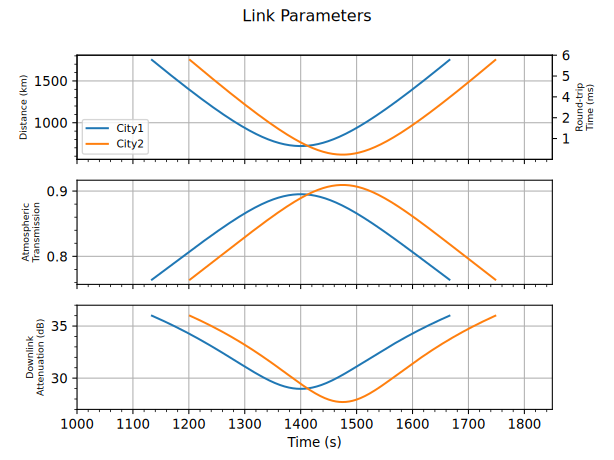

# Satellite Links in QuISP
To enable the simulation of hybrid large-scale quantum networks, QuISP supports satellite quantum links.
To simulate a satellite link, users need to provide CSV files containing the distance (m) and atmospheric transmission (linear, not in dB) as a function of time over a passage (see the `satellite_test_csvs/` folder for examples).
Distance and transmission CSVs can be generated through a variety of means spanning from actual atmospheric simulation toolkits to simple geometrical models. The examples currently included in QuISP where generated through a [Python script](https://gist.github.com/pfittipaldi/924c22808ac977378e4dd70ca0a98ca6) implementing a simple flat-earth geometrical model.

Currently, multiple passages are simulated by looping the same CSV file. This is physically inaccurate, and it would be a quick and easy extension to the satellite code to have multiple CSVs pertaining to multiple passages.

The loss model for the free space satellite links was adopted from [de Forges de Parny et al.](https://www.nature.com/articles/s42005-022-01123-7).

## Quick Start

To run a simulation with a satellite link, choose one of the SAT configurations in the `satellite_simulations_test.ini` file. To design your own, use Sat nodes both at the ground and at the space end of the link, specifying `is_satellite=true` in the parameters of the satellite node.

## Additional useful information about satellite simulation

- While it is still possible to specify error rates for free space channels, notice that unlike in fiber channels these are NOT rates per kilometer, since there is no expression to calculate the total rate. This is not a serious problem since free space is a much more isotropic propagation medium than fiber, and the lead imperfection in it is by far losses.

- The  CSV path must be specified with respect to your current working directory. For Cmdenv based simulations and tests, this is `quisp/quisp`. In case your simulation cannot find the CSV files, check that the working directory is correctly set in your launch configuration.

## Validation of the Results

Even though simulation tests for quantum links are present in the code base, satellite links' time-varying nature makes them more difficult to validate through simulation tests. Therefore, in addition to the description found in [our paper](https://arxiv.org/abs/2405.07589), we provide here a comparison of simulation results obtained through QuISP against our theoretical model. The links modeled by our CSV files have the following parameters:

### Simulation tests, Scenario 1
 

### Simulation tests, Scenario 2
 

## Code Breakdown

Enabling satellite communication with QuISP relies on three fundamental elements: the `PointingSystem`, the `GatedQueue` and the `Free Space Channel`.

### The Pointing System

This module is in charge of simulating the acquisition, pointing and tracking between the satellite and the ground nodes. In practice, this node receives a `VisibilityCheckRequest` (VCR) packet and replies with a `VisibilityCheckOutcome` (VCO) packet, which contains the `next_check_time` variable, i.e. the time interval to wait for the satellite to be visible again. If the satellite is already visible, `next_check_time` is 0.

### The Gated Queue

The purpose of `GatedQueue` is to buffer classical messages when the receiving node is not visible and therefore cannot receive messages.
This module works as an extension of the already present `Queue` module: whereas the original module was just in charge of queueing the packets that are incoming and outgoing from a given node, the `GatedQueue` adds a layer of control logic to the outgoing section. Whenever an outgoing message is ready to be sent, the `GatedQueue` runs a visibility check by generating a `VisibilityCheckRequest` packet and sending it to the `PointingSystem`. If the outcome of the visibility check is favorable (i.e. `next_check_time = 0`), the packet is sent normally. If not, another visibility check is run at `t + next_check_time`.

### The Free Space Channel

`FreeSpaceClassicalChannel` and `FreeSpaceQuantumChannel` are two new channel objects that model the variable attenuation and delay that comes with free-space communication with a moving node. By parsing CSV files that specify the length and atmospheric attenuation of the satellite link, these channels recalculate link parameters as part of the `processMessage` method. Nodes should have a `PointingSystem` that checks whether there is visibility before communicating: if a message is sent through a free-space channel when the receiving node is not visible, it is discarded by the channel.

## Modifications to existing components

Most of QuISP's internals worked seamlessly over the transition to satellite communication. However, a couple lines of code required tweaking:

- Each active BSA controller calculates the time at which photon emission should happen and shares it with its passive partner. Every time entanglement needs to be established, the active node schedules emission at time `now + travel_time` and instructs the passive node to attempt latching qubits in memory at `now + 2travel_time`, to account for the latency of the link and emit synchronously. In the original code, the (fiber) link delay can be calculated once and cached. However, a satellite link must account for the varying delay of a free-space link. Due to hardware constraints, it is unfeasible to recalculate the photon emission delay for every single photon, so the time interval between photon is left constant. What is changed is the emission time of the first photon of each train: every time an active node needs to start entanglement generation, it reads the orbit data in order to calculate what the link delay is now (`current_travel_time`) and what it will be after the photon request arrives at the receiving node (`predicted_travel_time`). Then, it schedules local emission for `now + current_travel_time` and instructs the passive node to emit at `now + current_travel_time + predicted_travel_time`. This way, the first photon of every emission train lines up perfectly. Although the rest of the train slowly drifts out of sync, it is not enough to disrupt entanglement generation even at low indistinguishability window values. A note should be made on EPPS links: since they work with continuous emission by making each photon the first and last of its respective train and using the inter-train delay as interval between photons, it is not possible to apply this modification directly. The (hacky) solution that was implemented was to schedule a periodic recalculation of the photon emission time. The time interval at which resynchronization is performed is a tunable parameter.

- The `RuleEngine` code was tweaked to reject a TimingNotification (BSA and EPPS) if it has a `first_photon_emit_time` that precedes the current `simTime()`. This of course never happens in the fiber case, but it covers the edge case of when the TimingNotification is generated with the satellite out of sight and sent when visibility is established again. Without this failsafe measure, Omnet++ produces an error when the `TimingNotification` is received and photon emission cannot be scheduled for a past time.

# Questions and Comments
If you have any further questions or comments about satellite simulation in QuISP, feel free to contact [Paolo Fittipaldi](mailto:paolo.fittipaldi@lip6.fr).
