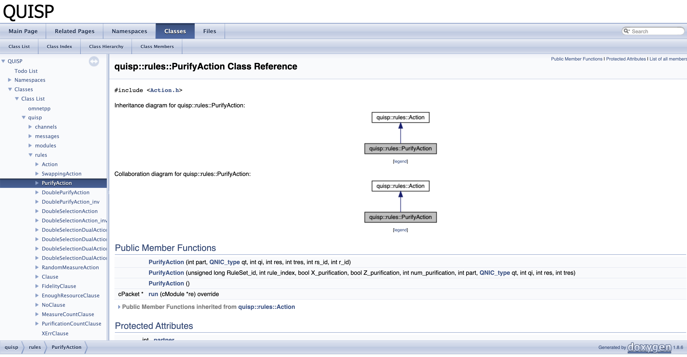
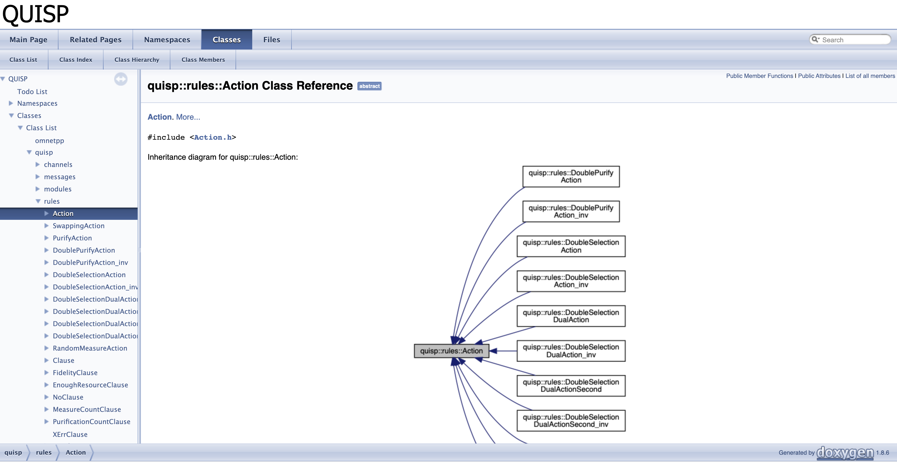

# Code Spelunking: Your First Foray #

There are several hundred pages of documentation [available on the OMNeT++ website](https://omnetpp.org/documentation/).  You'll want to
begin finding your way around in that.

In OMNeT++, practically all of the work is triggered via `cMessage`s,
passed from object to object, and network packets are `cPacket`s (see
Ch. 5 of the OMNeT++ manual).

This document is just to get you started; more complete documentation
will be coming eventually.  There is some information on the code
structure (which naturally will gradually go out of date) in Appendix
A of [Takaaki's master's thesis](https://arxiv.org/abs/1908.10758).

Most importantly, once you have a grasp of the basic lay of the land
in the code, you'll want to start looking at the [software design
documents](software-design.md).

You can also browse the [doxygen](http://www.doxygen.nl/)-generated [source code
documentation](html/index.html), if you have that installed and
compiled.  If you have it, you can see



and

.

The later is useful for finding all of the known rule types.  doxygen
is a command-line tool for generating the docs; if you need to update
it (or if the above link fails with file not found), just type

``` doxygen ```

from your top-level repository directory, and it will build all of the
docs in `doc/html` (assuming you have the doxygen tools installed),
all browsable through an ordinary Internet browser.


## Finding the "Application" that runs

If almost all of the action is triggered via a `cMessage`, almost all
of the hardware and software components are known as `module`s.  To
get oriented, see the [API for
cSimpleModule](https://doc.omnetpp.org/omnetpp/api/classomnetpp_1_1cSimpleModule.html).
Also see Sec. 4.4 of the OMNeT++ manual, "Adding Functionality to
cSimpleModule".

Each `module` is loaded and an instance of the object instantiated
based on being listed in a `.ned` file.  In `quisp/networks/QNode.ned`, you
will find

```
module QNode
{
...
    submodules:
        app: Application {
            parameters:
                address = address;//share the same address within all inner modules
                @display("p=30,43");
        }
```

Let's find the `initialize()` member function for that class.  There
should be one in each `module`.  For example, in
`quisp/modules/Application.cc`, you will find

```
void Application::initialize()
```

Inside that function, you will see it first checks its own node type;
if it's not an end node, it sends a message to delete itself.  (It
determines whether it's an end node by looking at whether there is a
`gate` connected to a router.)

Otherwise, assuming it's an EndNode, it proceeds and sets up the
application itself.

**One of the important open tasks is to build a better model of an
application, including both behavior of individual applications,
and an overall traffic model.**  This set of notes should help us
get started on that.

You will see, in the current implementation, that if the node's
address is 1, it picks a single other node at random and builds a
connection to it.  This is done by firing off a single
`ConnectionSetupRequest` message to that node; after that, all of the
connection setup proceeds in an event response fashion.  (At the
moment, loss of classical messages is not included, so there is no
need to monitor and retry the setup.)

## Finding the important software modules

In QuISP, there is a big, and important, distinction between the
_software_ for a quantum repeater, and the simulation of the
_hardware_.

In `quisp/networks/qrsa.ned`, you'll find the definitions of the key
software components:

```
simple RoutingDaemon
{
    parameters:
        int address;
    gates:
        //inout dummyQNICLink[];
}

simple HardwareMonitor
{
...
}

simple ConnectionManager
{
...
}

simple RuleEngine
{
...
}

simple RealTimeController
{
...
}
```

The `RoutingDaemon` should be obvious.

The `HardwareMonitor` performs tomography (below) and keeps track of
the link's condition, information that is (or should be) fed to the
`RoutingDaemon`.

The `ConnectionManager` handles incoming requests for connections,
either in end nodes or in those that are being transitted.  (The
process for this is described in our [Internet
Draft](https://datatracker.ietf.org/doc/draft-van-meter-qirg-quantum-connection-setup/).)
It should consult with the routing daemon to find the next hop toward
the destination, and with the hardware monitor to collect detailed
information about the links and memories that it packages into the
request before forwarding on the outbound setup request.  On the
return setup instructions, it should collect the RuleSets and give
them to the RuleEngine.

The `RuleEngine` is the heart of the event-driven action.  When
classical messages or photons arrive, or timers expire, the RE is
responsible for updating the repeater's software's understanding of
the qubits' state, for executing the actions for each rule whose
Condition (Match) clause is met, etc.

The `RealTimeController` is device drivers; it's the interface to the
classical control of the quantum devices.  In the simulation, it ties
pretty directly to the simulation of the qubits themselves.


(This figure should look familiar, it is used in multiple places.)

Those five `simple` objects are grouped into one software system,

```
module quantumRoutingSoft
{
...
}
```

which is used as a `submodule` in `module QNode`, found in
`quisp/networks/QNode.ned`, as described near the top of this
document.

## Our first RuleSet: Looking at the tomography code

Let's follow one chain of things through the code.  Let's see how the
link-level tomography gets kicked off and executed.

You'll find some useful definitions in `quisp/classical_messages.msg`:

```
packet LinkTomographyRuleSet extends header
{
    int process_id;
    int number_of_measuring_resources;
    RuleSetField RuleSet;
}

packet LinkTomographyRequest extends header
{
}
```

(along with several others).  Those are transformed automatically into
a file called `classical_messages_m.cc`; don't edit this file!

Link tomography is enabled by a parameter called, naturally enough,
`link_tomography`, a boolean.  It's defined in
`quisp/networks/qrsa.ned`:

```
simple HardwareMonitor
{
    parameters:
...
        bool link_tomography = default(false);
...
}
```

but if you grep through the `.ini` files shipped with this, you'll
find that the default is overridden in most of them, including (unless
this changes before release), the default `omnetpp.ini` file:

```
[Config Example_run]
network= Realistic_Layer2_Simple_MIM_MM_10km
...
**.num_measure = 7000
...
**.tomography_output_filename = "Example_run"
...
**.link_tomography = true
**.initial_purification = 2
**.Purification_type = 1001
```

Then you'll see in `HardwareMonitor.cc`:

```
void HardwareMonitor::initialize(int stage)
{
...
  do_link_level_tomography = par("link_tomography");
...
```

This function also sets up data structures to hold the tomography
data, which is a key part of HM's responsibility.

A little bit later in that function, the code checks each neighbor,
and if it has the higher address, does this:

```
              LinkTomographyRequest *pk = new LinkTomographyRequest;
              pk->setDestAddr(it->second.neighborQNode_address);
              pk->setSrcAddr(myAddress);
              pk->setKind(6);
              send(pk,"RouterPort$o");
```

(Yes, as of the moment, that packet Kind is hard-coded to 6.  Ugh.)

That sends the initial packet to the neighbor, who will receive it and
respond, then we will set up a set of rules.  The receiver sends an
ACK:

```
void HardwareMonitor::handleMessage(cMessage *msg){
    if(dynamic_cast<LinkTomographyRequest *>(msg) != nullptr){
        /*Received a tomography request from neighbor*/
        LinkTomographyRequest *request = check_and_cast<LinkTomographyRequest *>(msg);
        /*Prepare an acknowledgement*/
        LinkTomographyAck *pk = new LinkTomographyAck;
        pk->setSrcAddr(myAddress);
        pk->setDestAddr(request->getSrcAddr());
        pk->setKind(6);
...
        send(pk,"RouterPort$o");
```

Back at the first node, the reception of that will kick off the
creation of the RuleSet.  The same `handleMessage()` function is the
handler for that ACK, back at the initiator.  Chunks of that aren't
great code, with some hard-coded constants, but it works.  (Add that
to the work items list!)

```
void HardwareMonitor::sendLinkTomographyRuleSet(int my_address, int partner_address, QNIC_type qnic_type, int qnic_index, unsigned long RuleSet_id){
            LinkTomographyRuleSet *pk = new LinkTomographyRuleSet;
...
                        Rule* Purification = new Rule(RuleSet_id, rule_index);
                        Condition* Purification_condition = new Condition();
                        Clause* resource_clause = new EnoughResourceClause(2);
...
        //RuleSets sent for this node and the partner node.

        long RuleSet_id = createUniqueId();
        sendLinkTomographyRuleSet(myAddress, partner_address, my_qnic_type, my_qnic_index, RuleSet_id);
        sendLinkTomographyRuleSet(partner_address,myAddress, partner_qnic_type, partner_qnic_index, RuleSet_id);
```

There is a lot of similar code, depending on choice of purification
scheme; ultimately, this should be more flexible, cleaner code, too.
(Another item for the work list!)

Note that two RuleSets are created, and one is "sent" to yourself.

The next step is to look at `RuleEngine.cc` and see how messages are
handled there, in (naturally enough)
`RuleEngine::handleMessage(cMessage *msg)`.  Currently, that function
is rather messy, and due for a rewrite.

This source file also contains functions for locking and unlocking
resources.

This isn't really enough detail yet, but hopefully this document has
gotten you oriented to finding your way around inside the source code.

## Next

Now go look at the [software design documents](software-design.md).
