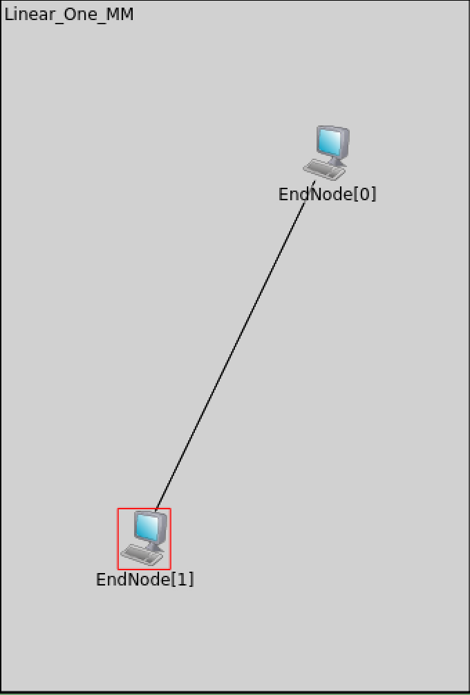
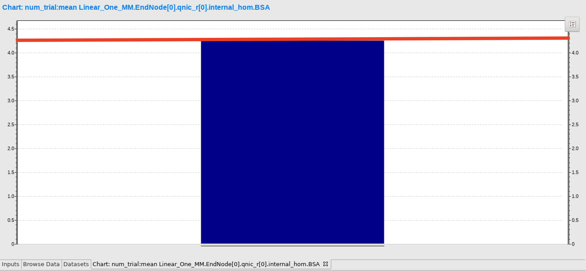
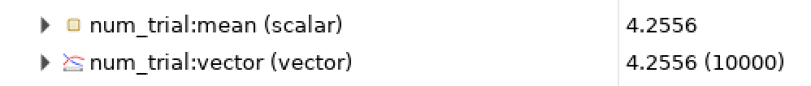
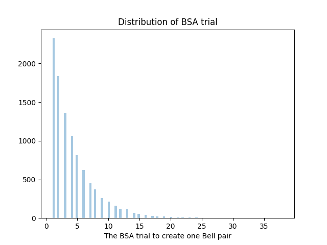
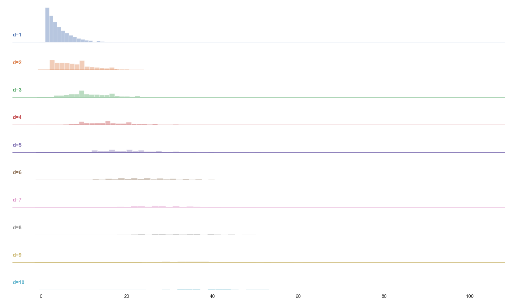
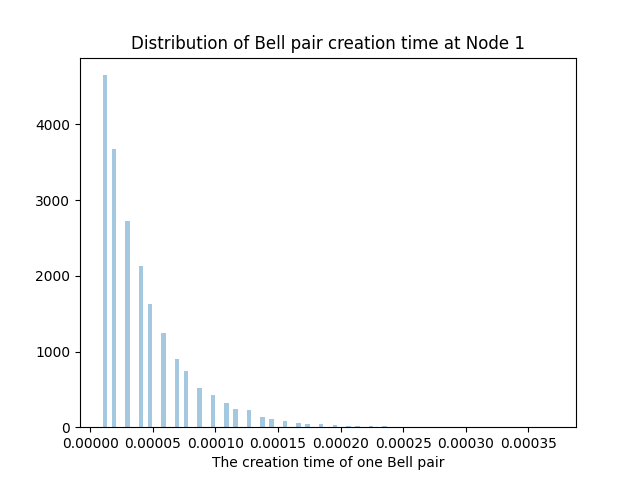
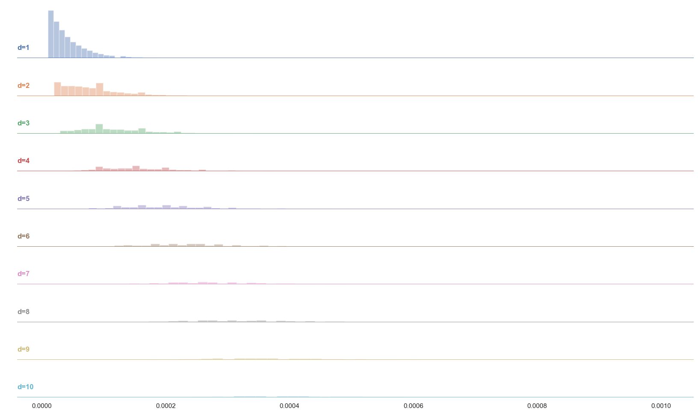

# Confirming Basic Operations

## 0. What are we going to do?
In this doc, we're going to verify the correctness of the quisp.
Basically, we're trying to investigate several static things of the link level Bell pairs.

### 0.1 Expriment
We set up an experiment with those parameters and networks.

- Network : Linear_One_MM
- Purification : False
- Number of qubits : 1
- Channel loss error rate : 0.1
- Emission success probability of photon : 0.9
- BSA success probabilty : 0.5 * 0.8 * 0.8
- photon detection per sec : 1000000000 /s

<!--  -->


## 1. Basic calculations

### 1.1 Success Probability of BSA

Bell state measurement is a stochastic process to combine entangled pairs. In the quisp, we calculate this success probability as,  because usually, we need to consider the detection rate of photon detector. At this point, we use 0.8 as probability photons are detected successfully. We have two detectors at BSA (Bell state analyzer). That's why we square 0.8.

### 1.2 Loss in fiber

Generally speaking, a quantum state is fragile. We have to deal with it to achieve successful quantum communication. Photon loss is one of them about which we need to care. Photon might be lost with some probability in the fiber with some possibility. If either photon from end nodes can't reach to the BSA, then we can't apply BSA, that means, we can't generate Bell state between them. In the quisp, we can set a value of photon loss in the .ned file. In this expriment, we set 0.1 /km. 

### 1.3 Emission success probability

When a quantum node tries to emit a photon to the other nodes or components, that node might fail to emit it with some problems. (e.g., A node couldn't generate a Bell pair successfully.) We define a probability that a node fails to emit a photon as "emission success probability." In this experiment, we set 0.9 for each quantum node.

### 1.4 Estimated success probability of total experiment

In this experiment, we can calculate success probability for whole experiment as  
   
   
That means, if we try BSA  4.286694 times in average, then hopefully we could generate one Bell pair between two nodes.

### 2. The average number of BSA trials to generate one Bell pair

We took the data 10000 times to take proper average.
  
  
We could get a value 4.2556. This value is close to the ideal value 4.286694. In terms of the average number of BSA, we could say quisp is working properly.

### 3. The distribution of the number of trials of BSA

We also analyzed the distribution of the number of trials to generate Bell pairs.
This is the result for the number of trials to generate one Bell pair.
 
In addtion to that, this is the result of the number of trials to generate a specific number of Bell pairs. As you can see, the distribution goes to Poisson distribution. 

### 4. Actual operation time for BSA

In the BSA process, we have a lot of operations. For example, exchanging packetes, rulesets, applying gates and so on.

We will see the time to complete this whole processes.

In the simulation, we need 0.000009740086 s to complete whole BSA process. So the average creation time of Bell pair is 0.000009740086*4.2556 = 4.1449e-5 (s)

### 5. Distribution of the creation time
The distribution of the operation time to create one Bell pair is,

and also, ridge plot for generating any number of Bell pair is
.

### 6. Python code to plot these.

This is a code to plot these distributions. (Not whole)
You can see the code at `quisp/scripts/perf.py` 
```python
import seaborn as sns
# This times is the data
sns.distplot(times, kde=False, rug=False,
                     bins=100, axlabel="The creation time of one Bell pair")
plt.show()
```
### 7. .ned & .ini files we used

As we explained in the first section, we used a specific configuration to verify the correctness.

You can see the .ini file (descriptions of simulation) at [here](../../quisp/networks/vector_test.ini).
