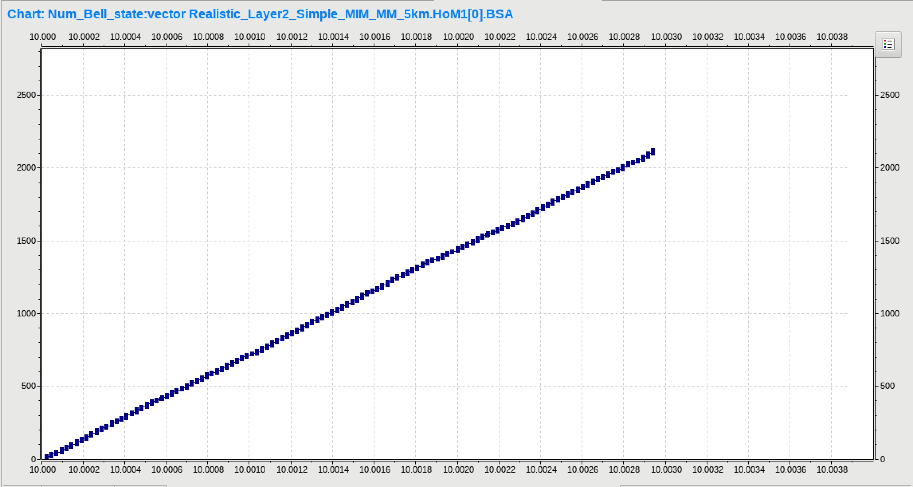
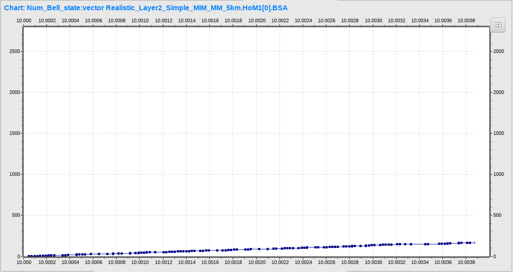
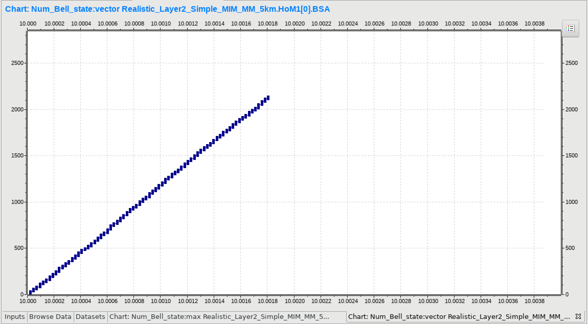
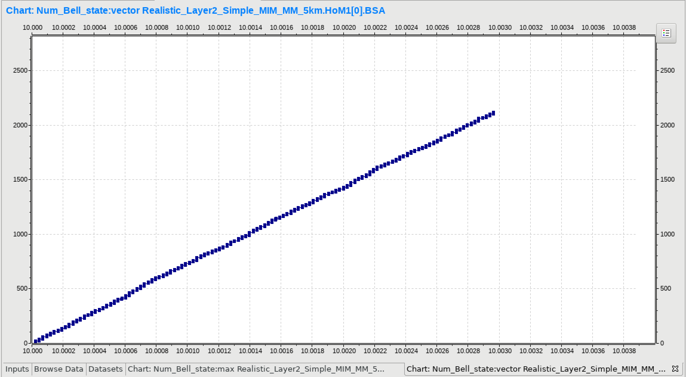
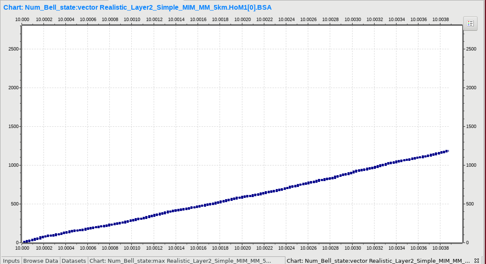

# Performance Analysis for QuISP

## What can we get?
The OMNeT++ provide basic tools for performance analysis. What we can get in the performance analysis is some plots like these.




### 1. Add the parameter you want to measure
First, we need to add a parameter to the .ned file. You can decide the name of the parameter you take. To record a parameter you need to add the following: 
```
@signal ["parameter name"](type="paramter type")
@statistic["paramter name"](title, record, interrpolationmode)
```


For details about these parameters, please refer to [this section in the OMNeT++ documentation](https://doc.omnetpp.org/omnetpp/manual/#cha:ana-sim).


### 2. Define a variable to store the result
Next, we have to connect .ned file to actual source code. In the example below, we have a private variable called `recog_resSignal`with type `simsignal_t`.

In the initialize function, we need to register the signal we decided with `registerSignal` function.


### 3. Emit a signal
In the simulation, we have to update paramters with `emit` function.
At the point where the parameter actually changes, we have to update parameter by using `emit` function.

### 4. That's all for configuration. Let's run the simulation.
Those are the requirements for measuring the performance. Let's run the simulation. When you run the simulation, it's better to specify the name of output files. In the .ini file, you can specify the name of vector file as
```
output-vector-file = "filenane.vec"
```
When the simulation completed, the .vec file should be inside network folder.

### 5. Vector file and plot
Click the .vec file in the network.
Format of vector file is,


In a vector file,
* running date and time
* attibutes of simulation
* parameters of simulation
* information of vector
* actual values
are included. 

## Tutorial
Let's try to run [tutorial](../../quisp/networks/vector_test.ini). Just run the simulation and show the vector file in the IDE.



