# Running Basic QuISP Demos

## Included Demos

QuISP is delivered with a lot of working network files, most of them
configurations from Takaaki Matsuo's master's thesis.  You will want
to start instead from a set of basic demos:

- **two nodes connected via a single MM (memory-to-memory) link**

<center>
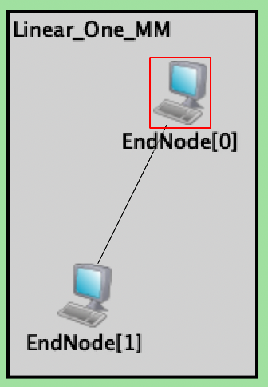
</center>

- **two nodes connected via a single MIM (memory-interference-memory)
  link**\
  "HoM" is a Bell state analyzer in the middle of the link

<center>
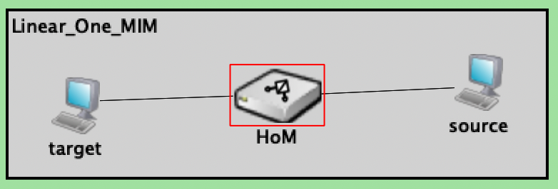
</center>

- ~~two nodes connected via a single MSM (memory-entangled photon pair
  source-memory) link~~ _(will be added after MSM links work)_
- ~~three different link architectures demo:  (MM, MIM, MSM)~~ _(will
  be added after MSM links work)_
- **twelve hops in a straight line**

<center>
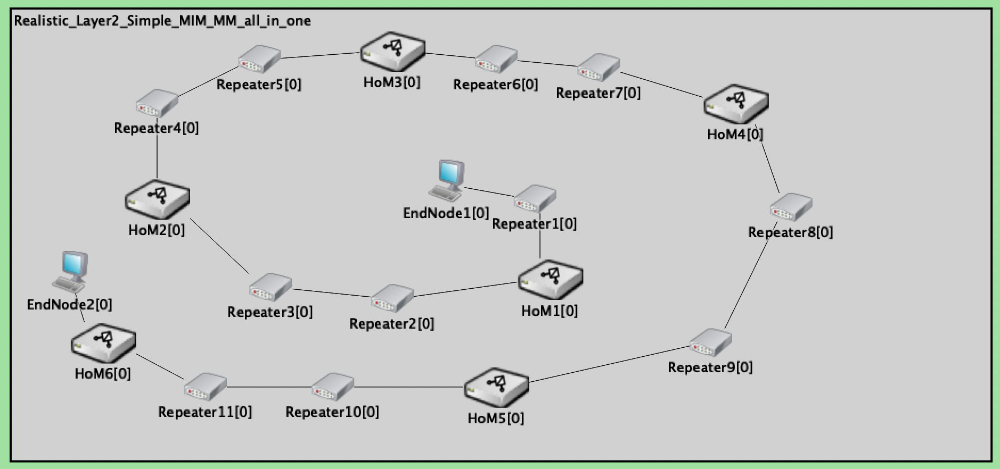
</center>

- **star topology with three links**

<center>
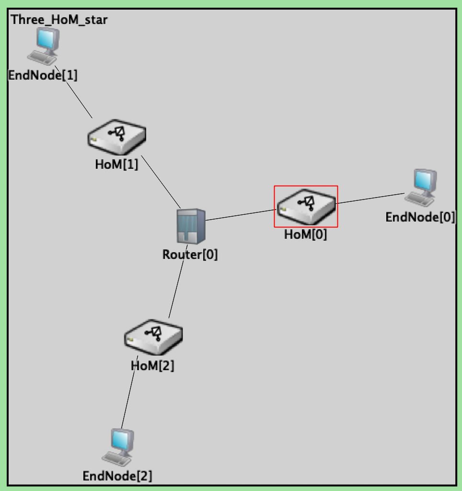
</center>

- **core with arms**: a moderately realistic near-term network\
  This network was used for much of the entanglement swapping development.

<center>
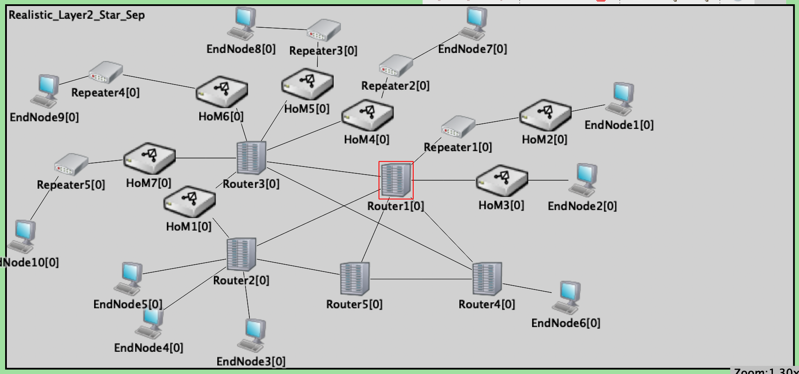
</center>

- **many nodes in a complex configuration**\
  (adapted from the topology of a real ISP; only center portion of the
  network shown)
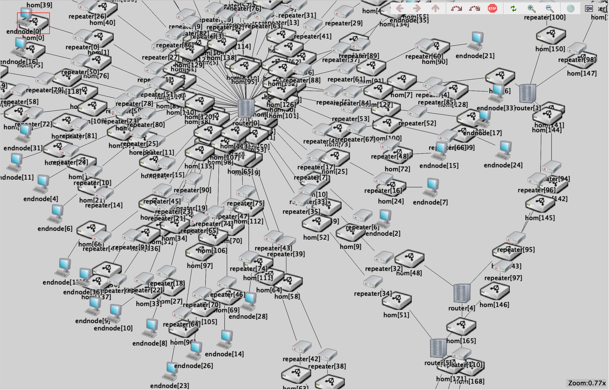

## Opening a Simulation

(If you arrived here from [Build on Windows](Build_on_windows.md),
some of this will look redundant; if not, we encourage you to skim
that document regardless of your platform.)

You should see a screen almost like this in the OMNeT++ IDE.

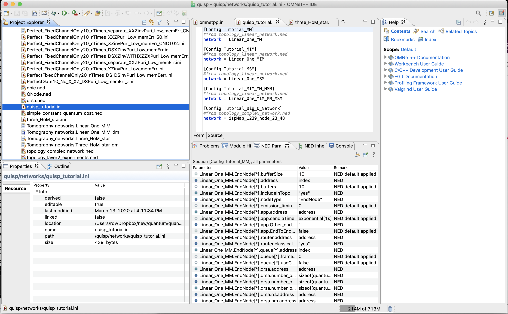

In the upper left panel, each of the subdirectories is probably
closed, like this:

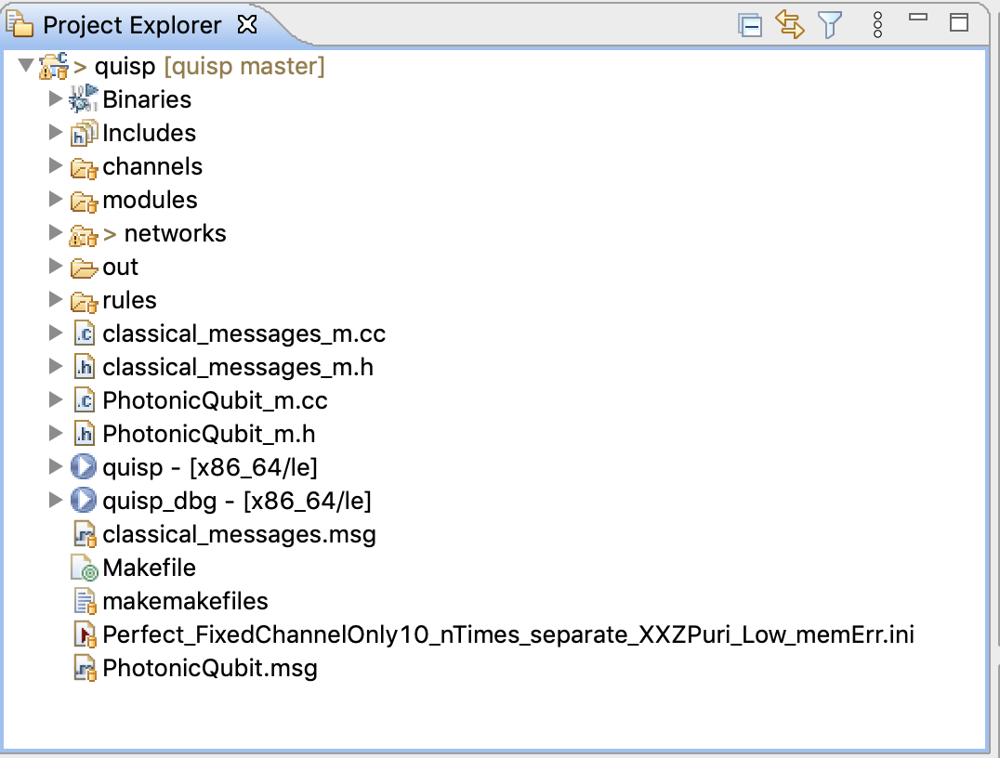

Click on `networks` and scroll down until you find
`quisp_tutorial.ini`.  Click on it, and your screen should look much
like the one above.  The upper middle panel has several tabs; when you
click on `quisp_tutorial.ini`, it should open a tab for that file, and
you should be able to see the set of networks included in this
tutorial.

You are still looking at the OMNeT++ IDE.  To run QuISP itself,
right-click on the `quisp_tutorial.ini` or click the triangle in the
green circle at the top (which you will need to do will vary depending
on what OMNeT++ thinks your current project is).  You may need to do
"run as OMNeT++ Simulation", as below.

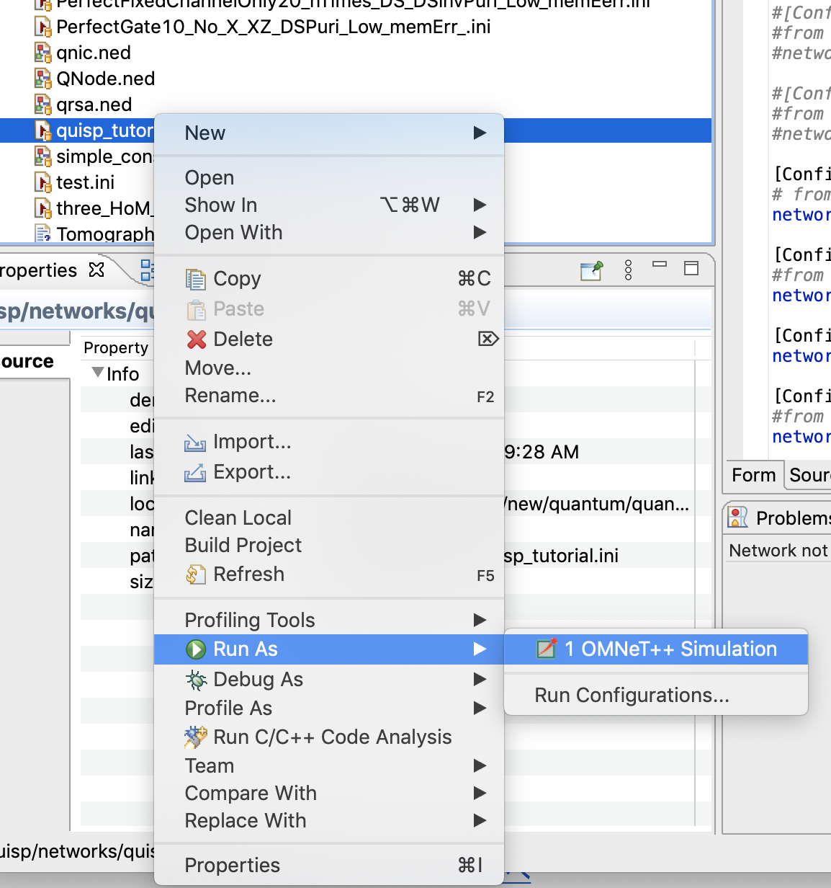

After you pick a network from the drop-down menu, the simulator will
ask you to set some parameters.  Generally, these parameters are
written into the `.ned` file (for fixed things related to the network
itself) or the `.ini` file (for parameters for specific experimental
runs), but we have set them up to be selected by you here.

For these demonstration simulations, there are four parameters to be
set interactively:

* application traffic pattern
* link-level tomography true/false
* choice of link-level purification scheme (11 options at the moment)
* number of rounds of purification (for most schemes)

One it will ask you for is TrafficPattern (n.b.: there is also the
parameter EndToEndConnection, which must be set to true):

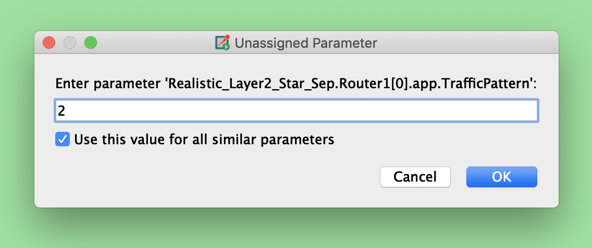

Pick one of the following:

```
0 No application traffic
1 A single connection from the node specified LoneInitiatorAddress to a random node
2 Every node picks a random partner
```

Make sure you check the "Use this value for all similar parameters"
tick box, or you'll have to set it for every individual node in the
network.  This value is read and used inside the "application" running
on each EndNode, in `modules/Application.cc`.

A set of parameters controls purification and tomography; they are
moderately complex because purification itself is rather complex.  See
Sections 2.8.3, 2.8.4, and 4.3 of [Takaaki's master's
thesis](https://arxiv.org/abs/1908.10758), our [Phys. Rev. A
paper](https://arxiv.org/abs/1904.08605) and your friendly
neighborhood purification specialist.

The parameters of interest are:
```
        bool link_tomography;
        int initial_purification;
        int Purification_type;
        int num_measure = default(3000);
```

The `link_tomography` boolean is pretty straightforward.  When on,
`num_measure` measurements will be taken and used to output the `_dm`
file.

`Purification_type` affects a large switch statement, picking from
among the different kinds of purification schemes for the _link_
(n.b.: purification beyond a single hop is not yet supported -- an
excellent project for someone!):

```
1001    Ss-Dp XZ Purification
2002    Ss-Sp / perfect binary tree, even rounds
3003    Ss-Sp / perfect binary tree, odd or even rounds
1221    Ss-Dp XZ, ZX alternating
1011    Ds-Sp: Fujii-san's Double selection purification
1021    Ds-Sp: Fujii-san's Double selection purification (alternating)
1031    Ds-Dp: full double selection purification (alternating)
1061    half double selection, half single selection
5555    Switching (B)
5556    Switching (A)
else    (default case code exists, but is deprecated)
```

`initial_purification` is a number whose effect varies depending on
the chosen link purification scheme; for most, the number of rounds
of purification is either this value or twice this value.

For a simple example, set purification_type to 2002, and
initial_purification to 1.  This will perform one round of X
purification, followed by one round of Z purification.

Purification is too complicated to detail here, but is defined by both
the _purification circuit_ to be executed and the _scheduling discipline_
used to select Bell pairs for use from among the available resources
(at the moment, all schemes implemented use only perfect trees;
pumping and banding are not supported).

The corresponding code contains _extensive_ comments and technical
justification and detailed descriptions of the options.  It is in the
file `HardwareMonitor.cc`, when you are ready to dig into code, since
it was all developed for the HM to characterize links.  Look for the
function `HardwareMonitor::sendLinkTomographyRuleSet`.  You can read
[the online copy](https://github.com/sfc-aqua/quisp/blob/master/quisp/modules/HardwareMonitor.cc)
or, better, generate the doxygen documentation and read locally on
your machine; the additional formatting is valuable, _circuit images_
are included, and it is the best way to ensure that the document you are
reading corresponds to the code you are executing.  If you are already
reading this document locally, [this link](html/classquisp_1_1modules_1_1_hardware_monitor.html) _may_ take
you there.

## What the Heck am I Looking At?

If you are running a simulation properly, you will see two or more
nodes, which may be any of several different node types distinguished
by different icons, connected via links (simple black lines).
Messages exchanged are always "packets" in OmNET++.  ("Messages" are
also internal, software object-to-object things.)  We represent
individual photons, classical physical signals (e.g., synchronization
pulses), and larger, digital classical messages all via different
types of packets.  You will see these flowing between nodes, along
with labels that tell you what they are.
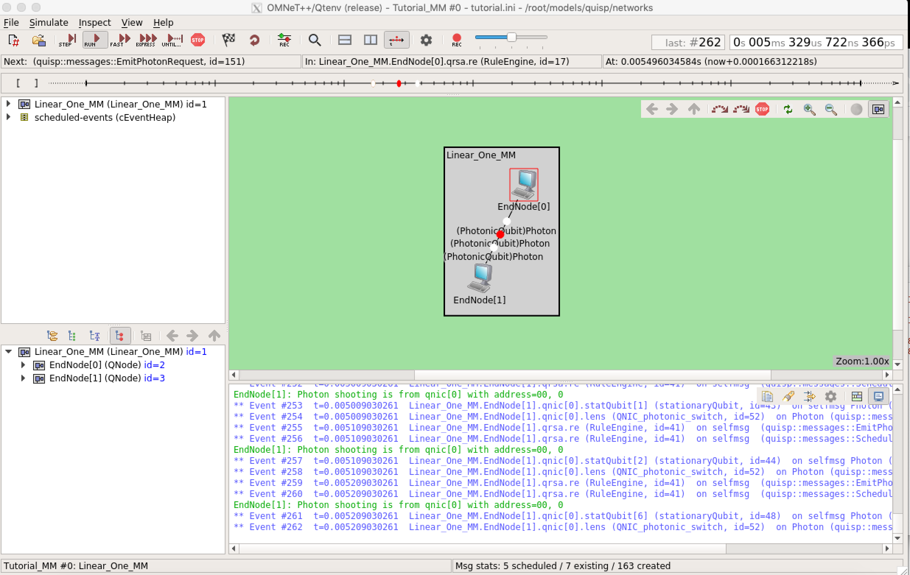

As of this writing, the colors (message kinds) assigned are as
follows:

```
RED	Just a photon in a burst. Not the beginning, nor the end.
WHITE	First or last photon in a burst (STATIONARY_PULSE_BOUND)
YELLOW	physical layer control (sync pulses, basically; classical physical signal)
GREEN	(reserved)
BLUE	ConnectionSetupResponse
CYAN	BSA (Bell state analysis) results (classical message); also entanglement swapping results (classical message)
MAGENTA	Link tomography results (memory measurement results?); also RejectConnectionSetup
BLACK	Purification results (classical message); also ConnectionSetupRequest
```

(These color assignments are artifacts of the coding; grep for
`setKind()` in the source code.
According to [one old message](https://groups.google.com/forum/#!topic/omnetpp/5p1ufXvpDwA)
on the OmNET++ mailing list from a decade ago, the "packet" (photon or
classical message) colors derive from the message kind, an internal
field related to the message definition.  Modulo 8, the colors you see
are:

```
0 = RED
1 = GREEN
2 = BLUE
3 = WHITE
4 = YELLOW
5 = CYAN
6 = MAGENTA
7 = BLACK
```
This packet "kind" is used in some demultiplexing, so we are choosing the assigned
kinds to make the animation as clear as possible.)

## Finding and interpreting the results

**kaaki, help fill this in!!!***

## Important file types you will encounter

As you are leaping through the sources, you will encounter many file
types.  A few of the most important ones are listed here.

### `_dm` file

A density matrix file -- this is generated as an output of the
simulator.  It is an ASCII text file.  This is the only file type that
is _completely_ unique to QuISP; the rest come from or extend standard
OmNET++ files.

This file is described in Appendix A.2.2 of Takaaki Matsuo's master's
thesis.

### `.ini` file

See especially the default file `omnetpp.ini`.  This is the main file
that drives your simulation scenarios.  Works in conjunction with one
`.ned` file(s).

`.ini` files can be created by hand, or edited using the OmNET++
built-in editor.  The files are described in Ch. 3 of the OmNET++ User
Guide, available [here](https://omnetpp.org/documentation/).

For the examples here, find and open `quisp_tutorial.ini`.  This simple
example contains five `Config` statements, each of which specifies a
`network`.  There are no other parameters in this simple tutorial, but
for a complex experiment, this file will be very long and will
specify values for many of the parameters in Appendix A.2.1 of
Matsuo's master's thesis.

### `.ned` file

Describes a network topology and hardware configuration.  Each `.ned`
file contains one or more `network` blocks, listing all of the nodes
and links.

`.ned` files can be created by hand, or edited using the OmNET++
built-in editor.  The files are described in Ch. 2 of the OmNET++ User
Guide, available [here](https://omnetpp.org/documentation/).

Find the file `topology_linear_network.ned`.  It should contain four
of the five demo networks listed above.  Inside a network block, you
will find nodes of type `repeater`, `HoM`, etc.  The definitions of
_those_ network types are automatically found from _other_ .ned
files; in this case, files named `qnic.ned`, `qrsa.ned`,
`QNode.ned`, and `channels.ned`.  Those define, among other things,
default values for parameters that you may override in the .ini file,
e.g. the default X gate error rate is set to zero in `qnic.ned`:

```
        double Xgate_error_rate = default(0);
```

This nested referencing of `.ned` files from first the `.ini` file and
then from other `.ned` files, with the automatic searching of
directories for corresponding network and module names and overriding
of the parameters, complicates sharing and archiving of experimental
parameter sets, but allows for referencing that makes for sharing of
parameters and for much less verbose individual files.

### `.msg` file

Describes the format and contents of the messages exchanged.  At the
moment, you will find one for classical messages
(`classical_messages.msg`) and one for quantum messages
(`PhotonicQubit.msg`).

### `.cc` and `.h` files

You know what these are.  There is a modest number of C++ files that
are specific to QuISP.

### Next steps

When you are ready to start contributing, you can start reading the
code, as [we have done](code-spelunking.md).
