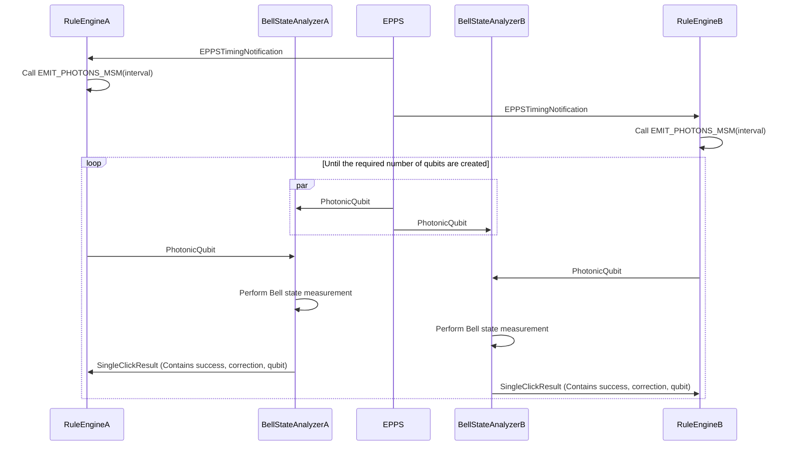
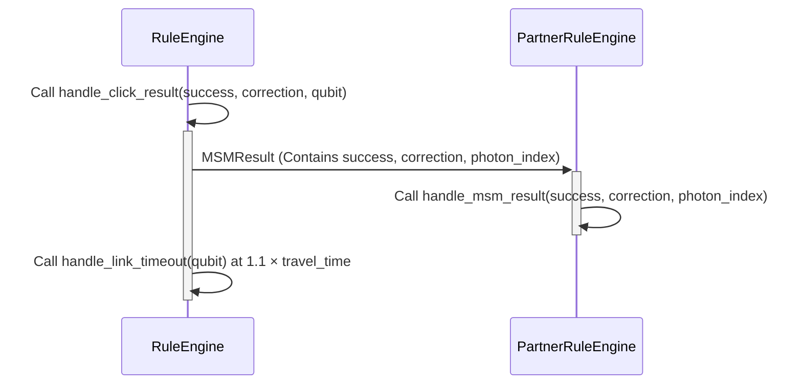

### MSM protocol details which take part in the RuleEngine

In a MSM protocol, the RuleEngine recieves an EPPSTimingNotification message. Then, the QNode prepares to emit photons from the specified timing with the specified interval. In this setting, the QNode contains an internal BSA, and the emitted photons are sent into there. The BSA performs a Bell state measurement on the emitted photon and one of the entangled photons sent from the EPPS.

After performing a single tiral of Bell state measurement, the result is sent back to the rule engine. Each emission iteration from the EPPS is counted locally at the QNode, named as `photon_index`. If we succeed in Bell state measurement we save the information of that qubit and `photon_index` in `success_list`, and for failure, we release that memory immediately.
Then, we send a message to the partner QNode with the result of the BSM and the `photon_index`. When a QNode receives a result from its partner, it compares the qubits with the same `photon_index`, and the following operations are performed:


Local BSM: fail | Partner BSM: success/fail
- No action is taken.

Local BSM: success | Partner BSM: fail
- Free the qubit that succeeded in the BSM.

Local BSM: success | Partner BSM: success
- Based on the results, correct the qubits.
- Save the information of the Bell pair in the bellpairstore.

Also, we ignore incoming photons for cases where there are no free memory. Therefore, when QNodeA does not have free memory and the QNodeB has free memory, QNodeB does not receive the BSM result from QNodeA, and for cases where the BSM at QNodeB succeeds, it cannot release the memory qubit forever. To counter this corner case, we set a timeout for each memory qubit, described in the pseudocode as `handle_link_timeout`.

We will show a sequence diagram of the MSM protocol below.


After a RuleEngine recieves SingleClickResult, the following operations are performed between the QNodes, in a classical channel:



We will show a pseudocode for major functions related to the MSM protocol, which also appeard in the sequence diagram above.

### Pseudocodes

#### Global Variables

- `photon_index`: Variable to specify the entangled photon pair. We perform post-processing among memory qubits that share the same value of this variable.

- `success_list`: List to store the information of memory qubits that succeeded local BSM. Contains the qubit information and the correction information.

#### Function to emit photons from qnodes in msm links

**Input:**
- Interval of emission specified by the EPPSTimingNotification: `interval`

**function:** EMIT_PHOTONS_MSM(`interval`)
1. Increment `photon_index_counter`
1. **If** There exist free memory qubits **then**
    1. Pick a free memory qubit and emit a photon from it
1. Wait for `interval` time and call EMIT_PHOTONS_MSM(`interval`)

#### Function to handle the click result

**Input:**
- BSM success result: `success`
- BSM correction operation: `correction`
- Memory qubit which emitted photon for this BSM: `qubit`

**function** HANDLE_CLICK_RESULT(`success`, `correction`, `qubit`)
1. **If** `success` **then**
    1. Append `qubit` and `correction` to `success_list`
    1. Call `handle_link_timeout(qubit)` after $1.1 \times$ `travel_time`
       - Waiting time should be longer than the travel time to the partner
1. **Else**
    1. Free `qubit`
1. Send `success, correction, photon_index` to the partner QNode


#### Function to handle the MSMResult

**Input:**
- Partner BSM success result: `success`
- Partner BSM correction operation: `correction`
- Photon index the partner performed BSM with: `photon_index`

**function** HANDLE_MSM_RESULT(`success`, `correction`, `photon_index`)
1. **If** found `photon_index` in `success_list` **then**
    1. Set `correction_local` $\gets$ `success_list[photon_index].correction`
    1. Set `qubit` $\gets$ `success_list[photon_index].qubit`
    1. **If** `success` **then**
        1. Set `qubit.handled` $\gets$ True
        1. **If** (`correction = correction_local` and `Addr_partner < Addr_self`) **then**
            1. Apply Pauli Z Gate to `qubit` (The reason is explained in the section below)
            1. Save bell pair information
    1. **Else**
        1. Free `qubit`


#### Function to handle the timeout

**Input:**
- Memory qubit: `qubit`

**function** HANDLE_QUBIT_TIMEOUT(`qubit`)
1. **If** (`qubit.handled` = False) **then**
    1. Free `qubit`
1. Set `qubit.handled` $\gets$ False


### Explanation of applying the Pauli Z gate for the case where the BSM results are different

We prepare the following entangled state at the beginning of the protocol.

- QNodeA releases entangled photon from memory in following state: $|\text{QNodeA}_{memory} \text{QNodeA}_{photon}\rangle = |\phi_+\rangle$.

- EPPS releases entangled photons in following state: $|\text{EPP}_{A} \text{EPP}_{B}\rangle = |\phi_+\rangle$.

- QNodeB releases entangled photon from memory in following state: $|\text{QNodeB}_{memory} \text{QNodeB}_{photon}\rangle = |\phi_+\rangle$.

After emission\, we perform bsm between $|\text{QNodeA}_{photon} \text{EPP}_{A}\rangle$, and $|\text{QNodeB}_{photon}\text{EPP}_{B}\rangle$.

The quantum circuit for this operation is as follows. (In this senario, we perform an optical BSM, so measuring $|\phi_{+}\rangle$ or $|\phi_{+}\rangle$, which are cases when EPA and EPB both measure state $|0\rangle$, should not happen)

```
     ┌───┐          ┌───┐
QAM: ┤ H ├──■────■──┤ H ├───────────────────
     └───┘┌─┴─┐  │  └───┘┌─┐
QAP: ─────┤ X ├──┼───────┤M├────────────────
     ┌───┐└───┘┌─┴─┐ ┌─┐ └╥┘┌───┐
EPA: ┤ H ├──■──┤ X ├─┤M├──╫─┤ X ├───────────
     └───┘┌─┴─┐└───┘ └╥┘  ║ └─┬─┘     ┌─┐
EPB: ─────┤ X ├───────╫───╫───┼───────┤M├────
     ┌───┐└───┘       ║   ║   │  ┌───┐└╥┘┌─┐
QBP: ┤ H ├──■─────────╫───╫───■──┤ H ├─╫─┤M├
     └───┘┌─┴─┐       ║   ║      └───┘ ║ └╥┘
QBM: ─────┤ X ├───────╫───╫────────────╫──╫─
          └───┘       ║   ║            ║  ║
reg: ═════════════════╩═══╩════════════╩══╩═

QAM: QNodeA_memory, QAP: QNodeA_photon, EPA: EPP_A, EPB: EPP_B, QBP: QNodeB_photon, QBM: QNodeB_memory
```
With simple calculation we can see that the state after this operation is $|\text{QNodeA}_{memory} \text{QNodeB}_{memory}\rangle = \frac{1}{\sqrt{2}}(|00\rangle + (-1)^{\psi^{A}+\psi^{B}}|11\rangle)$, where $\psi^{A/B}$ is the result of the BSM at QNodeA/B, with values $\psi^{A/B} = 0$ for obtaining $|\psi_{+}\rangle$ and $\psi^{A/B} = 1$ for $|\psi_{-}\rangle$.

Therefore, we need to apply a Pauli Z gate to either memory qubit if $\psi^{A}$ is not the same value as $\psi^{B}$.
